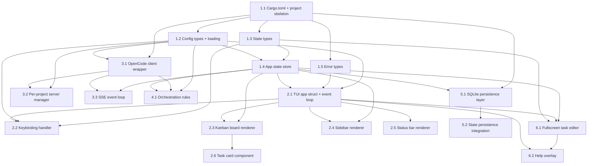

# Plan: cortex2 — Rust TUI Kanban Board with OpenCode SDK

## Purpose
Build a production-ready Rust CLI TUI Kanban board application using `ratatui` with `opencode-sdk-rs` integration. The app features a project sidebar, configurable kanban columns with task cards, OpenCode server management per project, session/task orchestration, and persistent state. This is a clean, from-scratch implementation — not a port.

## Architecture Overview

```
┌──────────────────────────────────────────────────────────┐
│                     main.rs (entry)                       │
│  Config → Server Manager → SDK Client → App → TUI Loop   │
├──────────┬──────────┬──────────┬──────────┬──────────────┤
│ config/  │ state/   │ opencode/│  tui/    │ orchestration│
│ TOML     │ Types +  │ Client + │ Render + │ Rules        │
│ loading  │ Store    │ Server   │ Events   │              │
├──────────┴──────────┴──────────┴──────────┴──────────────┤
│                 persistence/ (SQLite)                     │
└──────────────────────────────────────────────────────────┘
```

**Design principles:**
- **Simple state**: `Arc<Mutex<AppState>>` shared between the TUI loop and async tasks. No broadcast channels, no event routing. The TUI re-renders at 100ms ticks by reading current state.
- **Direct SDK usage**: Use `opencode-sdk-rs` APIs directly — `client.session().create()`, `client.session().chat()`, `client.event().list()` for SSE. The SDK handles retries, error mapping, and connection pooling internally.
- **Minimal abstraction**: No session manager class, no complex event dispatching. SSE events update state directly. The orchestration engine is just "check rules when a task moves."

## Dependency Graph



## Progress

### Wave 1 — Foundation (scaffolding, config, state types)
- [x] Task 1.1: Create Cargo.toml with all dependencies + project skeleton with `src/main.rs`
- [x] Task 1.2: Config module — types, defaults, TOML loading/saving, validation
- [x] Task 1.3: State types module — KanbanColumn, Task, Project, AgentStatus, UIState, etc.
- [x] Task 1.4: App state store — simple `Arc<Mutex<AppState>>` with mutation methods
- [x] Task 1.5: Error/result types — AppError enum, Result alias

### Wave 2 — TUI Layer (ratatui rendering + event handling)
- [x] Task 2.1: TUI App struct + crossterm event loop + terminal setup/teardown (depends: 1.2, 1.4, 1.5)
- [x] Task 2.2: Keybinding handler — parse config keybindings, match crossterm events to actions (depends: 1.2, 2.1)
- [x] Task 2.3: Kanban board renderer — column lanes with task cards using ratatui widgets (depends: 2.1, 1.4)
- [x] Task 2.4: Project sidebar renderer — far-left panel with project list and status indicators (depends: 2.1, 1.4)
- [x] Task 2.5: Status bar renderer — bottom bar showing notifications, connection status, key hints (depends: 2.1)
- [x] Task 2.6: Task card component — renders title + status text (depends: 2.3)

### Wave 3 — OpenCode Integration (SDK client, server, SSE)
- [x] Task 3.1: OpenCode client wrapper — thin SDK wrapper for session CRUD, chat, permissions (depends: 1.1, 1.2)
- [x] Task 3.2: Per-project server manager — spawn/stop server per project, health checks (depends: 1.2, 3.1)
- [x] Task 3.3: SSE event loop — subscribe to events, match variants, update state directly (depends: 3.1, 1.4)

### Wave 4 — Orchestration + Persistence
- [x] Task 4.1: Orchestration rules — simple config-driven task progression (depends: 1.2, 1.4, 3.1)
- [x] Task 5.1: SQLite persistence layer — schema, migrations, task/project CRUD (depends: 1.1, 1.3)
- [x] Task 5.2: State persistence integration — auto-save on dirty, restore on startup (depends: 5.1, 1.4, 2.1)

### Wave 5 — Task Editor + Help + Polish
- [x] Task 6.1: Fullscreen task editor — opencode-style editor for creating AND editing tasks (depends: 1.3, 2.1, 1.4)
- [x] Task 6.2: Help overlay — keybinding reference overlay with editor section (depends: 2.1, 1.2, 6.1)
- [x] Task 6.3: Main integration — wire everything together in main.rs, graceful shutdown (depends: all above)

## Detailed Specifications

### Task 1.1: Cargo.toml + Project Skeleton
**Files:** `Cargo.toml`, `src/main.rs`

Create `Cargo.toml` with:
```toml
[package]
name = "cortex2"
version = "0.1.0"
edition = "2021"

[dependencies]
# TUI
ratatui = "0.29"
crossterm = "0.28"

# Async
tokio = { version = "1", features = ["full"] }
futures = "0.3"

# Config
toml = "0.8"
serde = { version = "1", features = ["derive"] }
serde_json = "1"

# Persistence
rusqlite = { version = "0.32", features = ["bundled"] }

# OpenCode SDK — provides HTTP client (hpx), SSE streaming, typed API,
# automatic retries, structured errors.
opencode-sdk-rs = "0.2"

# HTTP client (server health checks only)
reqwest = { version = "0.12", default-features = false, features = ["rustls-tls"] }

# Utilities
uuid = { version = "1", features = ["v4"] }
chrono = "0.4"
log = "0.4"
env_logger = "0.11"
anyhow = "1"
```

Create `src/main.rs` with a minimal `fn main() { println!("cortex2"); }` placeholder.

Create directory structure:
```
src/
  config/
  state/
  opencode/
  tui/
  orchestration/
  persistence/
```

### Task 1.2: Config Module
**Files:** `src/config/mod.rs`, `src/config/types.rs`, `src/config/defaults.rs`

Design configuration types that match this TOML structure:

```toml
[opencode]
hostname = "127.0.0.1"
port = 11643
request_timeout_secs = 600

[opencode.model]
id = "glm-5-turbo"
provider = "zai-coding-plan"

[opencode.agents.planning]
model = "claude-sonnet-4-20250514"
instructions = "You are a planner."

[[columns]]
id = "todo"
display_name = "Todo"

[[columns]]
id = "planning"
display_name = "Plan"
agent = "planning"
auto_progress_to = "running"

[[columns]]
id = "running"
display_name = "Run"
agent = "do"

[[columns]]
id = "review"
display_name = "Review"
agent = "reviewer-alpha"

[[columns]]
id = "done"
display_name = "Done"
visible = false

[orchestration]
auto_start = { planning = true, running = true, review = true }
notify_column_empty = ["planning", "running", "review"]

[keybindings]
quit = "ctrl+q"
# ... etc

[theme]
sidebar_width = 20
column_width = 30
```

Define these types (all `#[derive(Serialize, Deserialize)]`):
- **`CortexConfig`** — top-level: opencode, columns, orchestration, keybindings, theme
- **`ColumnConfig`** — id, display_name (opt), visible (default true), agent (opt), auto_progress_to (opt)
- **`ColumnsConfig`** — ordered list of `ColumnConfig`, with helper methods: `display_name_for()`, `agent_for_column()`, `auto_progress_for()`, `visible_column_ids()`
- **`OpenCodeConfig`** — hostname, port, model (OpenCodeModelConfig), agents map, mcp_servers map, request_timeout_secs
- **`OpenCodeModelConfig`** — id, provider (opt), api_key_env (opt)
- **`OpenCodeAgentConfig`** — model (opt), instructions (opt), tools (opt), max_turns (opt), disable (opt), permission (opt HashMap)
- **`OpenCodeMcpServerConfig`** — command, args (opt), env (opt)
- **`OrchestrationRulesConfig`** — ifdone map, auto_start map, notify_column_empty list
- **`KeybindingConfig`** — each key is a comma-separated combo string (e.g., `"h, left"`)
- **`ThemeConfig`** — sidebar_width, column_width, status colors as hex strings

Provide in `defaults.rs`:
- `default_config() -> CortexConfig` — returns a sensible default config
- `DEFAULT_CONFIG_TOML` — static TOML string of the default config

Provide in `mod.rs`:
- `load_config(path: &Path) -> Result<CortexConfig>` — load TOML, deep-merge with defaults, validate
- `save_config(config: &CortexConfig, path: &Path) -> Result<()>` — serialize and write
- Config path: `~/.config/cortex2/cortex.toml`

### Task 1.3: State Types
**Files:** `src/state/types.rs`, `src/state/mod.rs`

Define the core domain types. These are plain data types with no behavior beyond helpers:

**Enums:**
- `KanbanColumn(pub String)` — newtype wrapping a column ID string. Constants: `TODO`, `PLANNING`, `RUNNING`, `REVIEW`, `DONE`. Methods: `default_columns()`, `default_visible_columns()`.
- `TaskAgentType` — None, Planning, Do, ReviewerAlpha/Beta/Gamma
- `AgentStatus` — Pending, Running, Hung, Complete, Error. Each has an `icon()` method returning a unicode char.
- `ProjectStatus` — Disconnected, Idle, Working, Question, Done, Error, Hung. Each has `icon()`.
- `ToolState` — Pending, Running, Completed, Error
- `AppMode` — `Normal`, `TaskEditor`, `Help`. Determines which view is rendered and how keystrokes are routed. This replaces the previous `FocusedPanel` approach — the kanban board is always "focused" when in Normal mode, and the task editor completely takes over in TaskEditor mode.
- `EditorField` — `Title`, `Description`. Tracks which field is focused in the task editor.
- `FocusedPanel` — Kanban, TaskDetail (sidebar is never focused; used only in Normal mode)
- `MessageRole` — User, Assistant
- `NotificationVariant` — Info, Success, Warning, Error

**Structs:**
- `CortexTask` — id, number, title, description, column, session_id (opt), agent_type, agent_status, entered_column_at, last_activity_at, error_message (opt), plan_output (opt), pending_permission_count, pending_question_count, created_at, updated_at, project_id
- `CortexProject` — id, name, working_directory, status, position
- `KanbanState` — columns (HashMap<KanbanColumn, Vec<String>>), focused_column, focused_task_index per column
- `UIState` — mode (AppMode, default Normal), focused_panel, focused_column, focused_task_id, viewing_task_id (opt), show_help, notification (opt), input_text, task_editor (Option<TaskEditorState>)
- `Notification` — message, variant, expires_at
- `TaskEditorState` — tracks all state for the fullscreen task editor:
  - `task_id: Option<String>` — `None` = creating new task, `Some(id)` = editing existing task
  - `title: String` — current title text
  - `description: String` — current description text (multi-line, newline-separated)
  - `focused_field: EditorField` — which field receives keyboard input (Title or Description)
  - `cursor_row: usize` — cursor row position (0 for title, 0..N for description lines)
  - `cursor_col: usize` — cursor column position within the current line
  - `scroll_offset: usize` — vertical scroll offset for description textarea (number of lines scrolled past the top of the visible area)
  - `column_id: Option<String>` — target column to place task on save (defaults to focused column)
  - `agent_type: TaskAgentType` — optional agent type selector
- `TaskMessage` — id, role, parts (Vec<TaskMessagePart>), created_at
- `TaskMessagePart` — enum: Text{text}, Tool{id/tool/state/input/output/error}, StepStart{id}, StepFinish{id}, Agent{id/agent}, Reasoning{text}, Unknown
- `PermissionRequest` — id, session_id, tool_name, description, status, details
- `QuestionRequest` — id, session_id, question, answers, status
- `TaskDetailSession` — task_id, session_id (opt), messages, streaming_text (opt), pending_permissions, pending_questions

**Top-level:**
- `AppState` — projects, tasks (HashMap), kanban, ui, connected (bool), active_project_id (opt), task_number_counters (HashMap)

**TaskEditorState methods:**
- `new_for_create(default_column: &str) -> Self` — creates empty state for a new task
- `new_for_edit(task: &CortexTask) -> Self` — pre-populates from existing task
- `current_line(&self) -> &str` — returns the text of the line the cursor is on
- `insert_char(&mut self, ch: char)` — inserts character at cursor position in the focused field
- `delete_char_back(&mut self)` — deletes character before cursor (backspace)
- `delete_char_forward(&mut self)` — deletes character at cursor (delete key)
- `insert_newline(&mut self)` — inserts `\n` at cursor (only in description field)
- `move_cursor(&mut self, direction: CursorDirection)` — arrow key movement (Up/Down/Left/Right), clamped to valid positions
- `ensure_cursor_visible(&mut self, visible_height: usize)` — adjusts scroll_offset so cursor row is within the visible textarea area
- `to_task_fields(&self) -> (String, String)` — returns (title, description) for saving

### Task 1.4: App State Store
**Files:** `src/state/store.rs`

Design a simple state management approach. Use `Arc<Mutex<AppState>>` shared between the TUI loop and async tasks. No broadcast channels needed — the TUI re-renders at 100ms ticks by reading current state.

**`AppState`** (from Task 1.3) is the single source of truth. Mutation methods are plain `&mut self` methods that update state. No events, no channels.

Provide a `Store` wrapper (or just impl methods directly on AppState):
```
impl AppState {
    // Project methods
    fn add_project(&mut self, project: CortexProject)
    fn remove_project(&mut self, project_id: &str)
    fn select_project(&mut self, project_id: &str)
    
    // Task methods
    fn create_todo(&mut self, title: String, description: String, project_id: &str) -> CortexTask
    fn move_task(&mut self, task_id: &str, to_column: KanbanColumn) -> bool
    fn delete_task(&mut self, task_id: &str) -> bool
    fn update_task_agent_status(&mut self, task_id: &str, status: AgentStatus)
    fn set_task_session_id(&mut self, task_id: &str, session_id: Option<String>)
    fn set_task_error(&mut self, task_id: &str, error: String)
    
    // Session mapping (session_id → task_id for O(1) lookup)
    fn session_to_task: HashMap<String, String>  // maintained internally
    fn get_task_id_by_session(&self, session_id: &str) -> Option<&str>
    
    // Navigation
    fn set_focused_column(&mut self, column: KanbanColumn)
    fn set_focused_task(&mut self, task_id: Option<String>)
    fn open_task_detail(&mut self, task_id: &str)
    fn close_task_detail(&mut self)
    
    // Task editor mode
    fn open_task_editor_create(&mut self, default_column: &str)
    fn open_task_editor_edit(&mut self, task_id: &str)
    fn save_task_editor(&mut self) -> Result<String>  // returns task_id
    fn cancel_task_editor(&mut self)
    fn get_task_editor(&self) -> Option<&TaskEditorState>
    fn get_task_editor_mut(&mut self) -> Option<&mut TaskEditorState>
    
    // Notification
    fn set_notification(&mut self, message: String, variant: NotificationVariant, duration_ms: i64)
    
    // Session data (for task detail view)
    fn update_session_messages(&mut self, task_id: &str, messages: Vec<TaskMessage>)
    fn update_streaming_text(&mut self, task_id: &str, text: Option<String>)
    fn add_permission_request(&mut self, task_id: &str, request: PermissionRequest)
    fn resolve_permission_request(&mut self, task_id: &str, permission_id: &str, approved: bool)
    
    // SSE processing helpers (called directly from SSE loop)
    fn process_session_status(&mut self, session_id: &str, status: &str)
    fn process_session_idle(&mut self, session_id: &str)
    fn process_session_error(&mut self, session_id: &str, error: &str)
    fn process_message_updated(&mut self, session_id: &str, message: TaskMessage)
    fn process_message_part_delta(&mut self, session_id: &str, delta: &str)
    fn process_permission_asked(&mut self, session_id: &str, perm_id: &str, tool: &str, desc: &str)
    
    // Dirty flag for persistence
    fn mark_dirty(&self)  // uses AtomicBool
    fn take_dirty(&self) -> bool
    
    // Persistence
    fn restore_state(&mut self, projects, tasks, kanban_columns, active_project_id, counters)
}
```

The `session_to_task` reverse index is maintained internally by `set_task_session_id()`. It provides O(1) lookups when processing SSE events that reference sessions.

### Task 1.5: Error Types
**Files:** `src/error.rs`

Define a small `AppError` enum wrapping anyhow for the TUI layer, plus a `Result<T>` type alias. This gives clean error handling in the event loop.

### Task 2.1: TUI App Struct + Event Loop
**Files:** `src/tui/mod.rs`, `src/tui/app.rs`

The core TUI application:
- `App` struct holding: `Arc<Mutex<AppState>>`, config, terminal handle
- Terminal setup: `crossterm::terminal::enable_raw_mode`, `EnterAlternateScreen`, create `ratatui::Terminal<Backend>`
- Event loop using `tokio::select!`:
  ```
  loop {
      tokio::select! {
          event = read_crossterm_event() => handle event
          _ = tick_interval.tick() => {} // periodic re-render
      }
      terminal.draw(|f| render(f, &app))?;
  }
  ```
  The tick interval is 100ms. On each tick (and after each key event), we lock `AppState`, read current state, and render. No event routing needed — state changes from SSE/async tasks are picked up on the next render tick.
- Terminal teardown on quit: `disable_raw_mode`, `LeaveAlternateScreen`

**Mode-aware rendering and event routing:**

The render function checks `ui.mode` and renders ONE of:
- `AppMode::Normal` → standard layout: sidebar + kanban board + status bar
- `AppMode::TaskEditor` → fullscreen task editor (covers entire terminal, no sidebar/kanban visible)
- `AppMode::Help` → help overlay rendered on top of the frozen kanban view

The event handler checks `ui.mode` and routes keystrokes:
- `AppMode::Normal` → delegate to `KeyMatcher` for configured keybindings → `Action` enum handling
- `AppMode::TaskEditor` → delegate to `handle_editor_input()` which uses fixed (non-configurable) keybindings for text editing
- `AppMode::Help` → any key dismisses help and returns to Normal mode

**Layout (Normal mode):**
- `Layout::default().direction(Horizontal).constraints([sidebar, kanban])`
- The sidebar is always rendered but never "focused" — project navigation uses dedicated global keybindings (PrevProject/NextProject) that work regardless of which panel is active

### Task 2.2: Keybinding Handler
**Files:** `src/tui/keys.rs`, `src/tui/editor_handler.rs`

**Configurable keybindings (Normal mode only):**

- Parse `KeybindingConfig` strings (e.g., `"h, left"`, `"ctrl+q"`) into `crossterm::event::KeyEvent` matchers
- Build a `KeyMatcher` struct that maps `KeyEvent → Action` enum
- `Action` enum:
  - **Global (always available in Normal mode):** Quit, HelpToggle, PrevProject, NextProject, NewProject
  - **Panel-local:** CreateTask, EditTask, MoveForward, MoveBackward, NavUp, NavDown, NavLeft, NavRight, DeleteTask, AbortSession, ViewTask
- Handle leader key (ctrl+a prefix): store pending leader, wait for next key
- Default project navigation keybindings: `ctrl+k` / `ctrl+j` for NextProject / PrevProject, `ctrl+n` for NewProject

**Fixed editor keybindings (TaskEditor mode):**

When `ui.mode == AppMode::TaskEditor`, keystrokes are routed to `handle_editor_input()` in `src/tui/editor_handler.rs`. These are **NOT configurable** — they are fixed editor keybindings:

| Key | Action |
|-----|--------|
| Printable chars | Insert character at cursor in focused field |
| Enter | If focused on Title → move focus to Description. If focused on Description → insert newline |
| Tab | Cycle focus: Title → Description → Title |
| Backspace | Delete character before cursor |
| Delete | Delete character at cursor |
| Arrow Up/Down/Left/Right | Move cursor (clamped to valid positions) |
| Home | Move cursor to start of current line |
| End | Move cursor to end of current line |
| Ctrl+S or Ctrl+Enter | Save task (create or update) and return to Normal mode |
| Escape | Cancel editor, discard changes, return to Normal mode |
| Page Up / Page Down | Scroll description textarea by visible height |

The editor handler receives `&mut TaskEditorState` directly and mutates it. It returns an `EditorAction` enum:
```rust
enum EditorAction {
    None,           // character consumed, continue
    Save,           // Ctrl+S — save and close editor
    Cancel,         // Escape — discard and close editor
}
```

The event loop checks `ui.mode` first. If `TaskEditor`, it calls `handle_editor_input()` and processes the returned `EditorAction` (calling `save_task_editor()` or `cancel_task_editor()` on state).

### Task 2.3: Kanban Board Renderer
**Files:** `src/tui/kanban.rs`

- Render visible columns as vertical lanes side-by-side
- Use `Layout::default().direction(Horizontal)` with equal-width constraints
- Each column has a header (column display name + task count) and a scrollable list of task cards
- Highlight the focused column with a distinct border color
- Handle horizontal scrolling when columns exceed terminal width
- Support cursor-based navigation between columns

### Task 2.4: Project Sidebar Renderer
**Files:** `src/tui/sidebar.rs`

- Render as a fixed-width panel on the far left (width from `theme.sidebar_width`)
- Show project list with status icons (using `ProjectStatus::icon()`)
- Highlight the active/selected project with a distinct style
- Show "working"/"idle"/"error" status per project based on aggregate task states
- The sidebar is purely informational — it never receives keyboard focus or panel focus
- Project selection is changed via global PrevProject/NextProject keybindings

### Task 2.5: Status Bar Renderer
**Files:** `src/tui/status_bar.rs`

- Bottom bar spanning full terminal width
- Left: connection status (connected/disconnected to OpenCode)
- Center: active notification toast (if any, auto-clears after expiry)
- Right: keybinding hints for current context (e.g., "m:move  x:delete  ?:help  ^j/^k:project")

### Task 2.6: Task Card Component
**Files:** `src/tui/task_card.rs`

- Render a task as a bordered card within a column
- Line 1: `#<number> <title>` (truncated to column width)
- Line 2: status text based on `agent_status`:
  - Running → `"◐ working"` (in status_working color)
  - Complete → `"✓ done"` (in status_done color)
  - Error → `"✗ failed"` (in status_error color)
  - Hung → `"⏸ hung"` (in status_hung color)
  - Pending → `"· pending"`
- Show `!` indicator for pending permissions, `?` for pending questions
- Selected card gets highlighted border

### Task 3.1: OpenCode Client Wrapper
**Files:** `src/opencode/mod.rs`, `src/opencode/client.rs`

Read the `opencode-sdk-rs` documentation and source. Create a minimal client wrapper that uses the SDK directly. The SDK (`opencode_sdk_rs::Opencode`) is internally `Clone + Send + Sync` — cloning is cheap since the inner HTTP connection pool is reference-counted.

**Construction:**
```rust
let sdk = opencode_sdk_rs::Opencode::builder()
    .base_url("http://127.0.0.1:11643")
    .timeout(Duration::from_secs(120))
    .max_retries(2)
    .build()?;
```

**Required methods:**
- `new(base_url) -> Result<Self>` / `from_config(&OpenCodeConfig) -> Result<Self>`
- **Session CRUD:**
  - `create_session() -> Result<Session>` — calls `sdk.session().create(None).await`
  - `send_prompt(session_id, text, agent, model) -> Result<SessionMessagesResponseItem>` — builds `SessionChatParams` with parts, optional agent override, optional model override. Calls `sdk.session().chat(session_id, &params, None).await`
  - `abort_session(session_id) -> Result<bool>` — calls `sdk.session().abort(session_id, None).await`
  - `get_messages(session_id) -> Result<SessionMessagesResponse>` — calls `sdk.session().messages(session_id, None).await`
  - `delete_session(session_id) -> Result<bool>` — calls `sdk.session().delete(session_id, None).await`
  - `list_sessions() -> Result<SessionListResponse>` — calls `sdk.session().list(None).await`
- **Permissions:**
  - `resolve_permission(session_id, permission_id, approved) -> Result<()>` — uses `sdk.post("/session/{id}/permission/{perm_id}", body, None)` since there's no typed SDK method
  - `resolve_question(session_id, question_id, answer) -> Result<()>` — uses `sdk.post("/session/{id}/question/{qid}", body, None)`
- **Events:**
  - `subscribe_to_events() -> Result<SseStream<EventListResponse>>` — calls `sdk.event().list().await`. The returned stream implements `futures::Stream<Item = Result<EventListResponse, _>>`.
- **App info:**
  - `get_app_info() -> Result<App>` — calls `sdk.app().get(None).await`
- **Prompt building:**
  - `build_prompt_for_agent(task, agent, context) -> String` — formats task title, description, plan output

**Key SDK types to import:**
- `opencode_sdk_rs::resources::event::EventListResponse` — the SSE event enum with ~30 variants (SessionCreated, SessionStatus, SessionIdle, SessionError, MessageUpdated, MessagePartUpdated, MessagePartDelta, PermissionAsked, PermissionReplied, QuestionAsked, etc.)
- `opencode_sdk_rs::resources::session::{Session, SessionChatParams, PartInput, TextPartInput, SessionChatModel, SessionMessagesResponse, SessionMessagesResponseItem, Part, Message}`
- `opencode_sdk_rs::resources::session::ToolState as SdkToolState` — has variants Pending, Running, Completed, Error
- `opencode_sdk_rs::resources::shared::SessionError` — error union with ProviderAuthError, ContextOverflowError, APIError, etc.
- `opencode_sdk_rs::SseStream` — the SSE stream type

**SDK→App type conversion helpers** (can live in `src/opencode/types.rs` or inline):
- Convert SDK `SessionMessagesResponseItem` → our `TaskMessage` (extract id, role from `Message::User`/`Message::Assistant`, convert parts)
- Convert SDK `Part` → our `TaskMessagePart` (Text, Tool with state/input/output/error, StepStart/Finish, Agent, Reasoning, Unknown for others)
- Convert SDK `SessionError` → human-readable error string
- Extract permission fields from `serde_json::Value` properties (id, sessionID, tool, title/description, details)
- Extract session_id from `EventListResponse` variants

### Task 3.2: Per-Project OpenCode Server Manager
**Files:** `src/opencode/server.rs`

Each project gets its own OpenCode server instance (different port). This is needed because each project has a different working directory.

**`OpenCodeServer` struct:**
- Holds an optional `tokio::process::Child` and the server URL
- `start(config, working_directory)` — spawn `opencode serve --hostname=<host> --port=<port>` with:
  - `OPENCODE_CONFIG_CONTENT` env var set to the JSON config (built from `OpenCodeConfig` — maps model, agents, mcp_servers to the format `opencode` CLI expects)
  - Current directory set to the project's `working_directory`
- `stop()` — SIGTERM the child process, wait up to 5s, then SIGKILL
- `is_running()` — check if process is still alive via `try_wait()`
- `wait_for_healthy()` — poll `GET /app` endpoint with 500ms intervals, up to 20s total

**`ServerManager` struct:**
- `HashMap<String, OpenCodeServer>` mapping project_id → server
- Port allocation: base_port + project_index (e.g., 11643, 11644, 11645...)
- `start_for_project(project_id, config, working_dir)` — starts a server for a project
- `stop_for_project(project_id)` — stops a specific project's server
- `stop_all()` — stops all servers (for shutdown)

**Config JSON building:**
- Convert `[opencode]` section to JSON: model as `"provider/model"` string, agents with field mapping (instructions→prompt, max_turns→maxSteps), mcp_servers to `{type: "local", command: [...]}` format, api_key_env resolved to `provider.<name>.options.apiKey`

### Task 3.3: SSE Event Loop
**Files:** `src/opencode/events.rs`

A simple async function that subscribes to the SSE event stream and updates `AppState` directly. No complex routing layer.

```rust
async fn sse_event_loop(
    client: OpenCodeClient,
    state: Arc<Mutex<AppState>>,
) {
    let stream = client.subscribe_to_events().await;
    pin_mut!(stream);
    
    while let Some(event) = stream.next().await {
        let event = match event { Ok(e) => e, Err(_) => continue };
        let mut state = state.lock().await;
        
        match event {
            EventListResponse::SessionStatus { properties } => {
                let status = properties.status.get("type").and_then(|v| v.as_str()).unwrap_or("unknown");
                state.process_session_status(&properties.session_id, status);
            }
            EventListResponse::SessionIdle { properties } => {
                state.process_session_idle(&properties.session_id);
                // Extract plan_output for planning column tasks
                // ...
            }
            EventListResponse::SessionError { properties } => {
                if let Some(sid) = &properties.session_id {
                    let msg = properties.error.as_ref().map(|e| format_session_error(e)).unwrap_or_default();
                    state.process_session_error(sid, &msg);
                }
            }
            EventListResponse::MessagePartDelta { properties } => {
                state.process_message_part_delta(&properties.session_id, &properties.delta);
            }
            EventListResponse::PermissionAsked { properties } => {
                // Extract fields from JSON, call state.process_permission_asked()
                // Auto-approve safe tools (read, write, glob, grep, list)
            }
            // ... handle other variants as needed
            _ => {} // Ignore events we don't care about
        }
    }
}
```

Key behaviors:
- **Reconnection**: If the stream ends or errors, sleep 2s with exponential backoff, then resubscribe
- **Auto-approve safe tools**: When a `PermissionAsked` event arrives for `read`, `write`, `glob`, `grep`, or `list`, immediately call `client.resolve_permission()` to approve it. This prevents tasks from getting stuck when the user isn't watching.
- **Plan extraction**: On `SessionIdle`, if the task is in the planning column, extract the last assistant message text and store as `plan_output`
- **Auto-approve is fire-and-forget**: Do it in a spawned task so it doesn't block the event loop

Spawn one SSE loop per active project's OpenCode client. Each runs as a `tokio::spawn` task.

### Task 4.1: Orchestration Rules
**Files:** `src/orchestration/mod.rs`, `src/orchestration/engine.rs`

A simple, config-driven approach. When a task moves to a new column:

1. **Check if the column has an agent** → if yes, start the agent (create session, build prompt, send)
2. **When agent completes** → check if column has `auto_progress_to` → if yes, move task automatically

This is implemented as plain functions, not a complex class hierarchy:

```rust
/// Called when a task is moved to a new column.
/// Starts an agent if the column has one configured.
async fn on_task_moved(
    task_id: &str,
    to_column: &KanbanColumn,
    state: &Arc<Mutex<AppState>>,
    client: &OpenCodeClient,
    columns_config: &ColumnsConfig,
) {
    if let Some(agent) = columns_config.agent_for_column(&to_column.0) {
        start_agent(task_id, &agent, state, client).await;
    }
}

/// Start an agent for a task: update status, create session, send prompt.
/// Runs in a spawned tokio task so it doesn't block the caller.
fn start_agent(
    task_id: &str,
    agent: &str,
    state: &Arc<Mutex<AppState>>,
    client: &OpenCodeClient,
) {
    // Update status immediately for UI feedback
    {
        let mut s = state.blocking_lock();
        s.update_task_agent_status(task_id, AgentStatus::Running);
    }
    
    // Clone what we need, spawn async work
    let state = state.clone();
    let client = client.clone();
    tokio::spawn(async move {
        // Build prompt, create/reuse session, send prompt
        // On error: set_task_error()
    });
}

/// Called when an agent completes (from SSE SessionIdle).
/// Auto-progresses if the column configures it.
fn on_agent_completed(
    task_id: &str,
    state: &mut AppState,
    columns_config: &ColumnsConfig,
) {
    let column = state.tasks.get(task_id).map(|t| t.column.clone());
    if let Some(col) = column {
        if let Some(target) = columns_config.auto_progress_for(&col.0) {
            state.move_task(task_id, KanbanColumn(target));
        }
    }
}
```

### Task 5.1: SQLite Persistence Layer
**Files:** `src/persistence/mod.rs`, `src/persistence/db.rs`

Simple SQLite persistence for tasks, projects, and kanban order.

**Schema:**
```sql
CREATE TABLE projects (
    id TEXT PRIMARY KEY,
    name TEXT NOT NULL,
    working_directory TEXT NOT NULL,
    status TEXT NOT NULL DEFAULT 'disconnected',
    position INTEGER NOT NULL DEFAULT 0
);

CREATE TABLE tasks (
    id TEXT PRIMARY KEY,
    number INTEGER NOT NULL,
    title TEXT NOT NULL,
    description TEXT DEFAULT '',
    column_id TEXT NOT NULL,
    session_id TEXT,
    agent_type TEXT DEFAULT 'none',
    agent_status TEXT DEFAULT 'pending',
    error_message TEXT,
    plan_output TEXT,
    pending_permission_count INTEGER DEFAULT 0,
    pending_question_count INTEGER DEFAULT 0,
    project_id TEXT NOT NULL REFERENCES projects(id),
    created_at INTEGER NOT NULL,
    updated_at INTEGER NOT NULL
);

CREATE TABLE kanban_order (
    column_id TEXT NOT NULL,
    task_id TEXT NOT NULL REFERENCES tasks(id),
    position INTEGER NOT NULL,
    PRIMARY KEY (column_id, task_id)
);

CREATE TABLE metadata (
    key TEXT PRIMARY KEY,
    value TEXT
);
```

**Methods:**
- `new(path: &Path) -> Result<Db>` — open connection, run migrations
- `save_task(&self, task: &CortexTask) -> Result<()>`
- `load_tasks(&self, project_id: &str) -> Result<Vec<CortexTask>>`
- `delete_task(&self, task_id: &str) -> Result<()>`
- `save_project(&self, project: &CortexProject) -> Result<()>`
- `load_projects(&self) -> Result<Vec<CortexProject>>`
- `delete_project(&self, project_id: &str) -> Result<()>`
- `save_kanban_order(&self, column: &KanbanColumn, task_ids: &[String]) -> Result<()>`
- `load_kanban_order(&self) -> Result<HashMap<KanbanColumn, Vec<String>>>`
- `get_next_task_number(&self, project_id: &str) -> Result<u32>`
- DB path: `~/.local/share/cortex2/cortex.db`

Use WAL journaling for concurrent reads during SSE processing.

### Task 5.2: State Persistence Integration
**Files:** `src/persistence/mod.rs` (extend)

- On startup: load projects, tasks, kanban order from SQLite → populate `AppState`
- Periodically (every 5s tick): check `take_dirty()` flag, if true → save all tasks and projects
- On shutdown: force-save everything
- Wire into `App` lifecycle

### Task 6.1: Fullscreen Task Editor
**Files:** `src/tui/task_editor.rs`, `src/tui/editor_handler.rs` (referenced from 2.2)

A fullscreen task editor panel inspired by the opencode client's composer UI. This is used for **both creating AND editing** tasks — the same screen, with pre-populated fields when editing an existing task.

**Visual design (matching opencode client style):**

```
╭──────────────────────────────────────────────────────────────╮
│                                                              │
│   Title:                                                     │
│  ╭──────────────────────────────────────────────────────────╮│
│  │ Implement auth middleware                                ▊││
│  ╰──────────────────────────────────────────────────────────╯│
│                                                              │
│   Description:                                               │
│  ╭──────────────────────────────────────────────────────────╮│
│  │ Add JWT-based authentication middleware to all API        ││
│  │ routes. The middleware should:                           ││
│  │                                                          ││
│  │ 1. Extract the Bearer token from Authorization header    ││
│  │ 2. Validate the JWT signature using the public key       ││
│  │ 3. Attach the decoded claims to the request context      ││
│  │ 4. Return 401 for invalid/expired tokens                 ││
│  │                                                          ││
│  │                                                          ││
│  │                                                          ▊││
│  ╰──────────────────────────────────────────────────────────╯│
│                                                              │
│           Enter: save  Esc: cancel  Tab: next field          │
╰──────────────────────────────────────────────────────────────╯
```

**Rendering specification:**

1. **Outer container** — `Block::default().borders(Borders::ALL).border_type(BorderType::Rounded).style(Style::default().bg(Color::Rgb(36, 40, 56)))` — takes up the **entire terminal** (`f.area()`), fully opaque. No sidebar, no kanban visible underneath.

2. **Inner layout** — vertical `Layout` with constraints:
   - Title label + title input field (fixed height ~3 rows)
   - Spacer (1 row)
   - Description label + description textarea (takes all remaining space)
   - Footer hint bar (fixed height ~1 row)

3. **Title field** — a 3-row bordered area:
   - Label: `"Title:"` in `Style::default().fg(Color::White).add_modifier(Modifier::BOLD)`
   - Input area: `Block::default().borders(Borders::ALL).border_type(BorderType::Rounded)`
     - Border color: `Color::Cyan` when focused (`EditorField::Title`), `Color::DarkGray` when unfocused
     - Inner text rendered as `Paragraph` with the title string, left-aligned
     - Cursor rendered as a solid block `▊` at the current position

4. **Description textarea** — a bordered area taking up most of the screen:
   - Label: `"Description:"` in bold white
   - Textarea: `Block::default().borders(Borders::ALL).border_type(BorderType::Rounded)`
     - Border color: `Color::Cyan` when focused (`EditorField::Description`), `Color::DarkGray` when unfocused
     - Inner area is the textarea viewport
   - Text rendered using `Paragraph::new(text).wrap(Wrap { trim: false })` — each line of the description `String` (split by `'\n'`) is a `Line` in the `Paragraph`
   - Only the visible portion of lines is rendered (scroll window based on `scroll_offset` and visible height)
   - Cursor rendered as a solid block `▊` at the correct (row, col) within the visible area

5. **Footer hint bar** — centered text at the bottom:
   - `Span::styled("Enter: save  Esc: cancel  Tab: next field", Style::default().fg(Color::DarkGray))`
   - Centered using a `Paragraph` with `Alignment::Center`

6. **Header bar** (optional, for edit mode) — if editing an existing task, show a subtle header:
   - `"[Editing #42] Implement auth middleware"` in `Color::DarkGray` at the top

**Textarea implementation (custom, no external crate):**

The textarea is implemented purely with `TaskEditorState` (defined in Task 1.3) and ratatui's `Paragraph` widget. No external textarea crate needed.

- **Text storage**: The description is a plain `String` with `\n` newlines. Split on `\n` to get lines for rendering.
- **Cursor positioning**: `(cursor_row, cursor_col)` within the description lines. Clamped to valid positions on every mutation.
- **Word wrapping**: For display, each logical line is wrapped to the textarea width. This means one logical line may produce multiple visual rows. Track visual_row ↔ logical_line mapping for correct cursor positioning.
  - Simplification: **do NOT do word-wrap for the text buffer**. Instead, store text as-is with `\n` separators. For display, use `Paragraph::wrap(Wrap { trim: false })` which handles visual wrapping. The cursor is positioned at `(cursor_row - scroll_offset, cursor_col)` within the visible area. If a line is longer than the textarea width, horizontal scrolling is not needed initially — just let the cursor go past the visible edge (it's acceptable for v1).
- **Scrolling**: `scroll_offset` tracks the first visible line index. When the cursor moves (arrow up/down, typing at bottom), call `ensure_cursor_visible(visible_height)` which adjusts `scroll_offset` so the cursor's logical row is within `[scroll_offset, scroll_offset + visible_height)`.
- **Rendering**: Build `Vec<Line>` from the description string (split by `\n`, skip lines before `scroll_offset`, take `visible_height` lines). Use `Paragraph::new(lines).wrap(Wrap { trim: false })`.
- **Cursor block**: After rendering the paragraph, place the cursor character `▊` at position `(cursor_row - scroll_offset, cursor_col)` using `f.set_cursor()` on the inner textarea area.

**Mode transitions:**

| Trigger | From | To | Action |
|---------|------|----|--------|
| User presses `n` (CreateTask action) | Normal | TaskEditor | Call `state.open_task_editor_create(column_id)` |
| User presses `e` on selected task (EditTask action) | Normal | TaskEditor | Call `state.open_task_editor_edit(task_id)` |
| Ctrl+S in editor | TaskEditor | Normal | Call `state.save_task_editor()` → creates or updates task |
| Escape in editor | TaskEditor | Normal | Call `state.cancel_task_editor()` → discards changes |

**Project creation** remains a simple inline mechanism (not a fullscreen editor). Project creation can be handled by:
- A small prompt at the bottom of the sidebar or status bar area asking for project name + working directory
- Or a two-step inline input (name first, then directory path)
- This is lightweight enough to not need a fullscreen editor — it only requires two short text fields

### Task 6.2: Help Overlay
**Files:** `src/tui/help.rs`

- Toggle with `?` key (in Normal mode only)
- Render centered overlay showing all keybindings from config
- Sections:
  - **Global keys**: quit (`ctrl+q`), help (`?`), project nav (`ctrl+j`/`ctrl+k`/`ctrl+n`)
  - **Kanban keys**: navigation (`h/j/k/l` or arrows), create task (`n`), edit task (`e`), move (`m`/`shift+m`), delete (`x`), abort session (`ctrl+a a`)
  - **Task Editor keys** (fixed, not from config):
    - `Tab` — cycle field focus (Title ↔ Description)
    - `Enter` — next field (title) / newline (description)
    - `Ctrl+S` / `Ctrl+Enter` — save task
    - `Escape` — cancel and discard
    - `Arrow keys` — move cursor
    - `Home/End` — line start/end
    - `Page Up/Down` — scroll description
    - `Backspace/Delete` — delete characters
- Dismiss with any key

### Task 6.3: Main Integration
**Files:** `src/main.rs` (update)

Wire everything together:
1. Parse CLI args (`--reset`, `--config <path>`)
2. Initialize logger
3. Load config from `~/.config/cortex2/cortex.toml`
4. Create `AppState` wrapped in `Arc<Mutex<>>`
5. Restore persisted state from SQLite
6. Create `OpenCodeClient` from config
7. Spawn OpenCode server(s) for project(s) using `ServerManager`
8. Start SSE event loop(s) as tokio tasks
9. Run TUI event loop
10. On quit: stop servers, persist state, teardown terminal

## Surprises & Discoveries

1. **SDK is well-designed**: `opencode-sdk-rs` provides a clean typed API. The `Opencode` client handles HTTP connection pooling, retries, and error mapping. SSE is handled via `SseStream<EventListResponse>` which implements `futures::Stream`. Permission resolution uses raw `sdk.post()` since there's no typed method.
2. **No broadcast channels needed**: The TUI re-renders at 100ms ticks. SSE events update `Arc<Mutex<AppState>>` directly. The next render tick picks up changes. This is much simpler than an event routing system.
3. **Per-project servers**: Each project needs its own `opencode serve` instance because each has a different working directory. Port allocation is base_port + project_index.
4. **SDK EventListResponse is a large enum**: ~30 variants, but we only care about ~10 (SessionStatus, SessionIdle, SessionError, MessagePartDelta, MessageUpdated, MessagePartUpdated, PermissionAsked, PermissionReplied, QuestionAsked). The rest can be ignored.
5. **Permission auto-approve is critical**: Without it, agents get stuck waiting for permission when the user isn't watching the task detail view. Safe tools (read, write, glob, grep, list) should be auto-approved.
6. **Config JSON format matters**: The `OPENCODE_CONFIG_CONTENT` env var expects specific field names (agent not agents, prompt not instructions, maxSteps not max_turns, mcp not mcp_servers, command as array not string+args).
7. **Custom textarea is sufficient**: No need for a textarea crate (like `tui-textarea`). A simple implementation using `String` + cursor position + scroll offset + ratatui's `Paragraph` widget with `Wrap` handles all requirements. The text is stored as a newline-separated string, split into lines for rendering, and the cursor is a block character positioned via `f.set_cursor()`.

## Decision Log

1. **ratatui over cursive**: ratatui is more actively maintained, has better documentation, and follows a more flexible immediate-mode rendering pattern.
2. **Per-project server ports**: Start at port 11643, increment per project.
3. **Config path**: `~/.config/cortex2/cortex.toml` (separate from cortex_rust)
4. **DB path**: `~/.local/share/cortex2/cortex.db`
5. **Simple state over event system**: `Arc<Mutex<AppState>>` with tick-based rendering. No broadcast channels. The TUI reads state every 100ms. SSE events mutate state directly. This is simpler and sufficient for a TUI.
6. **Build from scratch**: No code is ported from cortex_rust. We read the SDK documentation and implement fresh. The cortex_rust source was studied only to understand the SDK API surface.
7. **Orchestration as functions, not a class**: The orchestration logic is just "when task moves to column with agent → start agent" and "when agent completes → check auto_progress_to". No need for a complex engine class.
8. **No sidebar focus mode**: The sidebar is never a focusable panel. Project navigation uses dedicated global keybindings (`ctrl+j`/`ctrl+k` for prev/next project, `ctrl+n` for new project) that work from any panel.
9. **SSE loop per project**: Each project's OpenCode server has its own SSE stream. Each runs as a separate tokio task, all updating the same `Arc<Mutex<AppState>>`.
10. **Fullscreen task editor over inline input dialogs**: Replaced the original "inline text input overlay" approach with a fullscreen task editor that covers the entire terminal. This provides a proper multi-line textarea for task descriptions, pre-populated fields for editing, and a clean visual design matching the opencode client's composer UI. The same screen is used for both create and edit — differentiated by whether `TaskEditorState::task_id` is `Some` or `None`.
11. **AppMode enum over FocusedPanel extension**: Using a top-level `AppMode` enum (Normal/TaskEditor/Help) rather than adding a `TaskEditor` variant to `FocusedPanel`. The editor is a fundamentally different mode (different rendering, different key handling, different layout) — not just another panel to focus. This makes the mode routing cleaner and prevents accidental key conflicts.
12. **Fixed editor keybindings (not configurable)**: Editor keybindings (typing, cursor movement, Tab, Ctrl+S, Escape) are hardcoded, not loaded from config. These are universal text editing conventions — making them configurable would create confusion and add complexity for no real benefit.
13. **Custom textarea over external crate**: Implementing the textarea manually (String + cursor tracking + Paragraph widget) instead of using `tui-textarea` or similar crates. Keeps the dependency tree small, gives full control over rendering style (cyan borders, rounded corners, opencode-matching aesthetic), and the requirements are simple enough that a full crate is overkill.
14. **Project creation stays simple**: Projects only need a name and working directory — two short text fields. A fullscreen editor would be overkill. A small inline prompt (bottom of sidebar or status bar area) is sufficient.

## Outcomes & Retrospective
[To be completed during execution]
