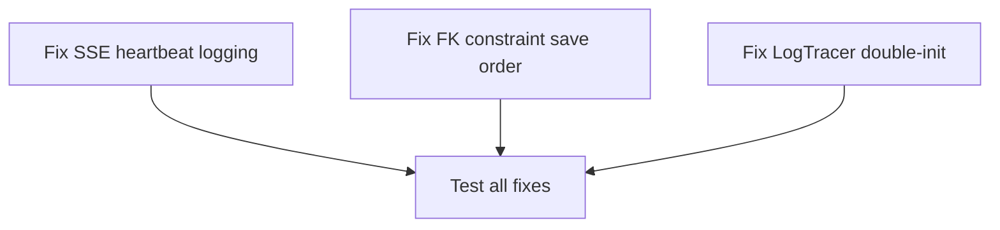

# Plan: Fix SSE Heartbeat Deserialization Error, FK Constraint Failure & LogTracer Init

## Purpose
Fix three bugs that cause noisy log warnings and data persistence failures:
1. **SSE `unknown variant 'server.heartbeat'`** — The OpenCode SDK's `EventListResponse` enum lacks a `server.heartbeat` variant. Since the enum uses `#[serde(tag = "type")]` with no catch-all, every heartbeat event (~5s interval) causes a serde deserialization error logged at WARN level.
2. **FK constraint failure during state save** — `save_state()` persists `kanban_order` rows **before** `tasks` rows, but `kanban_order.task_id` has a FK reference to `tasks(id)`. When a task is newly created (not yet in the DB from a prior save), the kanban order insert fails with `FOREIGN KEY constraint failed`.
3. **LogTracer bridge double-initialization** — `tracing-subscriber` 0.3.23 includes `tracing-log` (with `log-tracer` feature) as a **default feature**. Calling `.init()` automatically bridges `log` → `tracing` via `log::set_logger()`. The subsequent explicit `tracing_log::LogTracer::init()` call fails because the logger is already set, printing: `Warning: LogTracer bridge failed to initialize: attempted to set a logger after the logging system was already initialized`.

## Dependency Graph



All three fixes are independent — no dependencies between them.

## Progress

### Wave 1 — Independent fixes (parallelizable)
- [ ] Fix 1: Downgrade SSE unknown-variant errors from WARN to DEBUG in `src/opencode/events.rs`
- [ ] Fix 2: Reorder `save_state()` to save tasks before kanban_order in `src/persistence/mod.rs`
- [ ] Fix 3: Remove redundant `LogTracer::init()` call and clean up `Cargo.toml` dependencies

### Wave 2 — Verification
- [ ] Verify: Build compiles cleanly with `cargo build`

## Detailed Specifications

### Fix 1: SSE Heartbeat Deserialization Noise

**File:** `src/opencode/events.rs` (lines 29–36)

**Root cause:** The SDK's `EventListResponse` enum (`opencode-sdk-rs-0.2.0/src/resources/event.rs`) uses `#[serde(tag = "type")]` with 39 explicit variants. `server.heartbeat` is not among them. The SSE layer in `streaming.rs` only skips events with empty `data` — heartbeat events carry a JSON body like `{"type":"server.heartbeat","properties":{}}`, so they pass through to `serde_json::from_str` which fails.

The `Part` enum in the same SDK already has an `#[serde(other)] Unknown` catch-all, but `EventListResponse` does not. This is an upstream SDK gap.

**Fix:** In the `sse_event_loop` error handler, detect "unknown variant" deserialization errors and log them at `debug!` instead of `warn!`. Keep `warn!` for genuine SSE transport errors.

```rust
// Before (line 33):
Err(e) => {
    warn!("SSE event error: {}", e);
    continue;
}

// After:
Err(e) => {
    let msg = e.to_string();
    if msg.contains("unknown variant") {
        debug!("SSE unknown event type: {}", msg);
    } else {
        warn!("SSE event error: {}", msg);
    }
    continue;
}
```

**Why not patch the SDK?** The `EventListResponse` is an externally-tagged enum. Adding `#[serde(other)]` to an internally-tagged enum requires the catch-all variant to have a single `properties: serde_json::Value` field matching the content key. This is a clean upstream fix but requires forking/patching the SDK. The cortex-level fix is sufficient and non-invasive.

### Fix 2: FK Constraint — Wrong Save Order

**File:** `src/persistence/mod.rs` (lines 12–38)

**Root cause:** The `save_state` function persists data in this order:
1. Projects ✅ (no FK deps)
2. Kanban order ❌ (FK: `kanban_order.task_id → tasks.id`)
3. Tasks (FK: `tasks.project_id → projects.id`)

Since `PRAGMA foreign_keys=ON` is set in `Db::new()` (db.rs line 24), SQLite enforces FK constraints. When a task is newly created and dirty, the kanban order INSERT runs first and references a `task_id` that doesn't exist in the `tasks` table yet → FK violation.

**Fix:** Swap the order — save tasks before kanban order:

```rust
pub fn save_state(state: &AppState, db: &Db) -> AppResult<()> {
    // 1. Projects (no FK deps)
    for project in &state.projects {
        db.save_project(project)?;
    }

    // 2. Tasks (depends on projects — saved above)
    for task in state.tasks.values() {
        db.save_task(task)?;
    }

    // 3. Kanban order (depends on tasks — saved above)
    for (column_id, task_ids) in &state.kanban.columns {
        db.save_kanban_order(&KanbanColumn(column_id.clone()), task_ids)?;
    }

    // ... rest unchanged
}
```

**Additional consideration:** `save_kanban_order` does a DELETE of existing rows for the column first, then INSERTs. This means if the save partially fails (e.g., after kanban_order DELETE but before all INSERTs), the order data could be lost. This is a pre-existing concern and not introduced by this fix.

**Note:** This also fixes the shutdown save (main.rs line 265) which calls `save_state` directly, and the periodic save (main.rs line 234) which also calls `save_state`.

### Fix 3: LogTracer Bridge Double-Initialization

**File:** `src/main.rs` (lines 81–85) + `Cargo.toml` (lines 36–37)

**Root cause:** In `tracing-subscriber` 0.3.23, the **default features** include `tracing-log`:
```toml
# tracing-subscriber 0.3.23 Cargo.toml (published)
default = ["smallvec", "fmt", "ansi", "tracing-log", "std"]
```

This enables the `tracing-log` dependency with `features = ["log-tracer", "std"]`. When `tracing_subscriber::registry().with(...).init()` is called at line 79, it **automatically bridges `log` → `tracing`** by calling `log::set_logger()` internally. This means `log` records from any crate using the `log` facade are already forwarded to the tracing subscriber.

The explicit call at line 82:
```rust
if let Err(e) = tracing_log::LogTracer::init() {
    eprintln!("Warning: LogTracer bridge failed to initialize: {}", e);
}
```
attempts to call `log::set_logger()` **again**, which fails because the logger was already set by `tracing-subscriber`'s init. This produces the warning on every startup.

**Evidence from Cargo.lock:** `tracing-subscriber 0.3.23` lists `tracing-log` as a direct dependency, confirming the default feature is active.

**Fix:**
1. **Remove lines 81–85** from `src/main.rs` — the explicit `LogTracer::init()` call is redundant
2. **Remove `tracing-log = "0.2"` from `Cargo.toml`** — `tracing-subscriber` already includes it via default features
3. **Remove `log = "0.4"` from `Cargo.toml`** — no code in the project uses `log::` macros directly (verified via grep); the `log` → `tracing` bridge is handled by `tracing-subscriber`

```toml
# Cargo.toml — Before:
tracing = "0.1"
tracing-subscriber = { version = "0.3", features = ["env-filter"] }
tracing-appender = "0.2"
tracing-log = "0.2"
log = "0.4"  # kept for tracing-log bridge (downstream crates use `log`)

# Cargo.toml — After:
tracing = "0.1"
tracing-subscriber = { version = "0.3", features = ["env-filter"] }
tracing-appender = "0.2"
```

```rust
// main.rs — Before (lines 79–85):
        .init();

    // Bridge log records from crates using the `log` facade
    if let Err(e) = tracing_log::LogTracer::init() {
        // Already initialized by another subscriber — not fatal, but log it
        eprintln!("Warning: LogTracer bridge failed to initialize: {}", e);
    }

    tracing::debug!("Logging to {}/cortex.log", log_dir.display());

// main.rs — After:
        .init();

    tracing::debug!("Logging to {}/cortex.log", log_dir.display());
```

**Why this is safe:** The `tracing-subscriber` crate with default features already performs the exact same bridge that `tracing_log::LogTracer::init()` was trying to set up. No functionality is lost — `log` crate calls from downstream dependencies (like `rusqlite`, `reqwest`, etc.) will still be captured by the tracing subscriber.

**Alternative considered:** Move `LogTracer::init()` before `tracing_subscriber::init()` and silence the error. Rejected because it's still redundant — the bridge is already handled by `tracing-subscriber`.

## Surprises & Discoveries

1. **SDK gap is well-understood:** The `Part` enum in the same SDK already has `#[serde(other)] Unknown` — the `EventListResponse` enum simply missed this pattern. The SDK version is 0.2.0; a future version may add `server.heartbeat` or a catch-all.

2. **Periodic save opens a new DB connection each time:** (main.rs line 225) — `Db::new(&db_path_for_save)` is called every 5 seconds. Each call opens a fresh connection, runs migrations, and sets `PRAGMA foreign_keys=ON`. This is wasteful but not the cause of the FK issue. Noted as a potential optimization but out of scope for this fix.

3. **`save_kanban_order` deletes-then-inserts:** This is a full replacement strategy for each column's ordering. If any insert fails, prior ordering is lost. This is fragile but pre-existing.

4. **No `#[serde(other)]` for internally-tagged enums:** Unlike externally-tagged enums where `#[serde(other)]` works on a unit variant, internally-tagged enums require the catch-all variant to have a specific structure. The proper fix in the SDK would be:
   ```rust
   #[serde(other)]
   Unknown { properties: serde_json::Value },
   ```
   But `#[serde(other)]` with internally-tagged enums actually requires `#[serde(untagged)]` or custom deserialization — it's not straightforward, which may be why the SDK omitted it.

5. **`tracing-subscriber` 0.3.23 changed default features:** The `tracing-log` feature (with `log-tracer`) is now a default feature. In older versions (e.g., 0.3.17 and earlier), `log` was a separate opt-in feature. This means code that worked fine with older `tracing-subscriber` versions started producing this warning after a dependency update bumped to 0.3.23. The explicit `LogTracer::init()` call was likely added when `tracing-subscriber` did NOT auto-bridge, and became redundant after the version bump.

## Decision Log

| Decision | Rationale |
|----------|-----------|
| Log-level downgrade instead of SDK patch | Non-invasive; doesn't require maintaining a fork; heartbeat events are harmless |
| Fix save order instead of disabling FK checks | FK constraints are correct and valuable; the fix is the proper ordering |
| Don't optimize periodic DB connection reuse | Out of scope for this bug fix; separate concern |
| Remove `LogTracer::init()` instead of reordering it | `tracing-subscriber` 0.3.23 already handles the bridge; keeping both is redundant |
| Remove `log` and `tracing-log` from Cargo.toml | No code uses `log::` macros directly; `tracing-subscriber`'s defaults include the bridge |

## Outcomes & Retrospective

(To be completed during execution)
