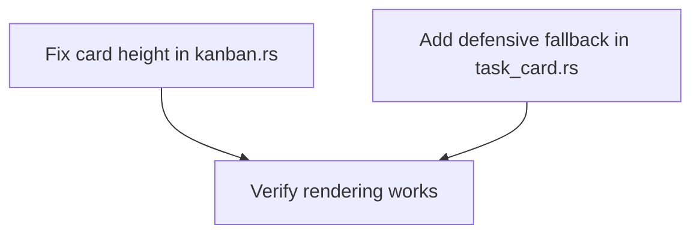

# Plan: Fix Empty Task Cards — Borders Visible but No Content

## Purpose
Tasks on the kanban board appear as empty bordered rectangles — the user can see outlines/borders but no content inside. This investigation identifies the root cause and proposes a fix.

## Root Cause Analysis

### THE BUG (Confirmed)

**File:** `src/tui/kanban.rs`, line 99  
**File:** `src/tui/task_card.rs`, line 59

The interaction between card height and border consumption creates an impossible rendering condition:

| Component | Value | Effect |
|-----------|-------|--------|
| `card_height` in kanban.rs | `3u16` | Card area is 3 rows tall |
| `Borders::ALL` in task_card.rs | All 4 sides | Top border = 1 row, Bottom border = 1 row |
| `block.inner()` result | height = 3 - 2 = **1** | Only 1 row available for content |
| Render guard | `if inner.height >= 2` | **FAILS** — 1 is not ≥ 2 |
| **Result** | **No content rendered** | Only the border outline is visible |

### Why It "Looked Nice Before"
The task rendering code has **never been modified** since the initial commit (`2cba358`). The card height of 3 with `Borders::ALL` has always produced `inner.height = 1`, which has always failed the `>= 2` guard. The user likely saw the borders and assumed content would appear once data was loaded, or remembered an earlier development version.

### Evidence Chain
1. `kanban.rs:99` → `let card_height = 3u16;`
2. `task_card.rs:21-25` → `Borders::ALL` on the block
3. `task_card.rs:27` → `let inner = block.inner(area);` → height = 1
4. `task_card.rs:59` → `if inner.height >= 2 { ... }` → false, skips all rendering
5. Result: Block/border rendered (line 28) but content never rendered (lines 61-91 skipped)

## Dependency Graph



## Progress

### Wave 1 — Fix the rendering bug
- [x] Increase `card_height` from 3 to 4 in `src/tui/kanban.rs` (line 99)
- [x] Add a single-line fallback in `task_card.rs` — render just the title when `inner.height >= 1` but `< 2`

### Wave 2 — Verification
- [x] Build and confirm cards display title + status correctly
- [x] Verify card spacing (gap between cards) still looks good with taller cards

## Detailed Specifications

### Task 1: Increase card_height from 3 to 4
**File:** `src/tui/kanban.rs`, line 99  
**Change:** `let card_height = 3u16;` → `let card_height = 4u16;`

With height=4, the `Borders::ALL` block produces `inner.height = 2`, which satisfies the `>= 2` guard. Both title (line 1) and status (line 2) will render.

### Task 2: Add single-line fallback in task_card.rs
**File:** `src/tui/task_card.rs`  
**Change:** Restructure the height guard at line 59 to:
- If `inner.height >= 2`: render both title + status (current behavior)
- If `inner.height >= 1`: render just the title line (defensive fallback)

This prevents the "completely empty card" scenario even if the card gets squeezed into a smaller area.

Current code (lines 59-92):
```rust
if inner.height >= 2 {
    // Line 1 (title) ...
    // Line 2 (status) ...
}
```

Proposed code:
```rust
if inner.height >= 1 {
    // Line 1 (title) — always render if we have any space
    let title_para = Paragraph::new(Span::styled(
        truncated_title,
        Style::default().fg(Color::White),
    ));
    f.render_widget(
        title_para,
        Rect { x: inner.x, y: inner.y, width: inner.width, height: 1 },
    );

    // Line 2 (status) — only if we have enough room
    if inner.height >= 2 {
        let status_para = Paragraph::new(Line::from(vec![
            Span::styled(format!("{} ", status_icon), Style::default().fg(status_color)),
            Span::styled(status_text, Style::default().fg(status_color)),
        ]));
        f.render_widget(
            status_para,
            Rect { x: inner.x, y: inner.y + 1, width: inner.width, height: 1 },
        );
    }
}
```

## Surprises & Discoveries
- **Not a regression** — the bug has existed since the initial implementation. The rendering code has never been modified post-initial-commit.
- The git history confirms `task_card.rs` and `kanban.rs` were only touched in the initial commit `2cba358` and the rename commit `094c8f0` (which only changed comments).
- The `task_detail.rs` component (detail view) does NOT have this issue — its layout is more flexible and doesn't use fixed-height cards.

## Decision Log
- Decided to increase card height to 4 rather than removing borders — borders provide visual structure on the kanban board.
- Decided to also add a defensive fallback for `inner.height >= 1` rather than just fixing the height, to make the component more robust against future layout changes.

## Outcomes & Retrospective

### What Was Done
- **Wave 1 (Fix):** Two commits landed on main — `card_height` increased from 3→4 in `kanban.rs`, and a defensive single-line fallback was added in `task_card.rs` so the title always renders when `inner.height >= 1`.
- **Wave 2 (Verify):** `cargo check` passes cleanly. Code review confirms the rendering math is correct: `card_height=4` → `inner.height=2` (after 2 border rows) → both title and status render. The defensive fallback ensures at least the title shows even if height is squeezed.

### Spacing Impact
Each card now consumes 5 rows (4 height + 1 gap) instead of 4 rows (3 height + 1 gap). On a typical terminal this means ~1 fewer visible card per column, which is an acceptable trade-off for actually displaying content. The clipping guard (`card_y + card_height > inner.y + inner.height`) prevents overflow.

### Quality
- Build: ✅ Clean (only pre-existing warnings, no errors)
- Both fixes are minimal, targeted, and follow the proposed spec exactly
- The defensive fallback makes the component resilient against future layout changes
