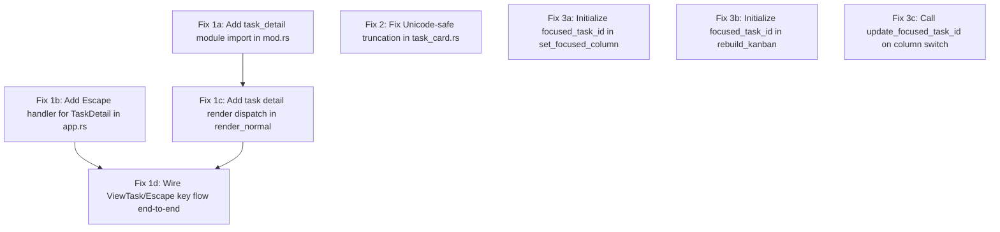

# Plan: Investigate and Fix Task View Regression

## Purpose
Fix three regressions in the task view system reported after a logging fix was applied:
1. Tasks can't be viewed (task detail panel never renders)
2. Task text rendering looks worse (byte-based truncation corrupts Unicode)
3. Single task selection no longer works (focused_task_id never initialized)

## Root Cause Analysis

### Bug 1: Task Detail View Completely Disconnected
The `task_detail.rs` file exists (480 lines) but is **never wired into the render pipeline**:

- **Missing module import**: `pub mod task_detail;` is absent from `src/tui/mod.rs` (lines 3-11 list 9 modules but not task_detail)
- **No render dispatch**: `render_normal()` in `src/tui/mod.rs` (lines 42-79) always renders kanban — it never checks `state.ui.focused_panel == FocusedPanel::TaskDetail`
- **No close handler**: `app.rs` `handle_normal_key()` has no Escape/Back handling for `FocusedPanel::TaskDetail`
- **State is set but ignored**: `ViewTask` action calls `open_task_detail()` which sets `focused_panel = TaskDetail` and `viewing_task_id`, but nothing reads these

### Bug 2: Unicode-Unsafe String Truncation in Task Card
`src/tui/task_card.rs` line 33-37:
```rust
let truncated_title = if title_line.len() > max_title_len {
    format!("{}...", &title_line[..max_title_len.saturating_sub(3)])
} else {
    title_line
};
```
- `title_line.len()` returns **byte length**, while `max_title_len` (from `inner.width`) is **column width**
- `&title_line[..n]` slices at byte boundaries — panics or corrupts multi-byte chars (emoji, CJK, accented chars)
- Comparison `len() > max_title_len` is wrong for any non-ASCII text

### Bug 3: focused_task_id Never Initialized
Tracing the initialization path:
1. `UIState::default()` → `focused_task_id: None`
2. `rebuild_kanban_for_project()` (store.rs:475) clears `focused_task_index` but doesn't set `focused_task_id`
3. `set_focused_column()` (store.rs:161) sets task INDEX but not task ID
4. `update_focused_task_id()` (app.rs:398) is only called during NavUp/NavDown, never during column switch or initial load
5. The kanban renderer requires `focused_task_id == Some(task_id)` (kanban.rs:97) — always fails when None

### Connection to Logging Fix
The logging fix commit (`60e784b`) likely isn't the direct cause. These appear to be pre-existing issues from the initial implementation that became noticeable around the same time. The rename refactoring (`094c8f0`) or the initial commit may have left the task_detail module orphaned.

## Dependency Graph



## Progress

### Wave 1 — Fix task detail rendering (Bug 1)
- [x] 1a. Add `pub mod task_detail;` to `src/tui/mod.rs` module declarations
- [x] 1b. Add Escape key handler for `FocusedPanel::TaskDetail` in `src/tui/app.rs` `handle_normal_key()` — call `close_task_detail()` on Escape
- [x] 1c. Add `focused_panel` check in `render_normal()` — when `TaskDetail`, render `task_detail::render_task_detail()` instead of kanban in the main area (keep sidebar + status bar)
- [x] 1d. Verify `ViewTask` action → `open_task_detail()` → render → Escape → `close_task_detail()` flow works end-to-end

### Wave 2 — Fix text rendering and selection (Bugs 2 & 3, parallel)
- [ ] 2a. Replace byte-based truncation in `src/tui/task_card.rs` with Unicode-safe character-width-aware truncation using `.chars()` iterator and `unicode_width` crate (or manual ASCII-aware fallback)
- [ ] 2b. In `src/state/store.rs` `set_focused_column()`: after setting the index, also update `focused_task_id` by looking up the task at that index in the column
- [ ] 2c. In `src/state/store.rs` `rebuild_kanban_for_project()`: after rebuilding columns, initialize `focused_task_id` for the default column (first task in first visible column)
- [ ] 2d. In `src/tui/app.rs` NavLeft/NavRight handlers: call `update_focused_task_id()` after `set_focused_column()` to sync the task ID

## Detailed Specifications

### Fix 1a: Add module import
**File**: `src/tui/mod.rs` line 11 (after `pub mod task_editor;`)
**Change**: Add `pub mod task_detail;`

### Fix 1b: Add Escape handler for TaskDetail
**File**: `src/tui/app.rs`, `handle_normal_key()` method
**Change**: At the start of the method (before `KeyMatcher` dispatch), check if `focused_panel == FocusedPanel::TaskDetail`. If so, handle Escape by calling `close_task_detail()` and return. Allow other keys (like y/n for permissions) to pass through.

```rust
// Check if we're in task detail view
{
    let state = self.state.lock().unwrap();
    if state.ui.focused_panel == FocusedPanel::TaskDetail {
        // In task detail: Escape closes it, other keys handled below
        if key.code == KeyCode::Esc {
            let mut state = self.state.lock().unwrap();
            state.close_task_detail();
            return;
        }
        // TODO: handle y/n for permission approval here
    }
}
```

### Fix 1c: Render dispatch for task detail
**File**: `src/tui/mod.rs`, `render_normal()` function
**Change**: In the kanban content area, check `state.ui.focused_panel`. If `TaskDetail`, render the task detail panel instead of the kanban.

```rust
// In render_normal(), replace:
kanban::render_kanban(f, kanban_v[0], state, config);

// With:
match state.ui.focused_panel {
    FocusedPanel::Kanban => {
        kanban::render_kanban(f, kanban_v[0], state, config);
    }
    FocusedPanel::TaskDetail => {
        if let Some(ref task_id) = state.ui.viewing_task_id {
            task_detail::render_task_detail(f, kanban_v[0], state, task_id);
        } else {
            kanban::render_kanban(f, kanban_v[0], state, config);
        }
    }
}
```

### Fix 2a: Unicode-safe truncation
**File**: `src/tui/task_card.rs`, lines 31-37
**Change**: Replace byte-based slicing with character-aware truncation.

```rust
// Replace:
let truncated_title = if title_line.len() > max_title_len {
    format!("{}...", &title_line[..max_title_len.saturating_sub(3)])
} else {
    title_line
};

// With:
let truncated_title = if title_line.chars().count() > max_title_len {
    let truncated: String = title_line.chars().take(max_title_len.saturating_sub(3)).collect();
    format!("{}...", truncated)
} else {
    title_line
};
```

Note: For full CJK support, consider using `unicode-segmentation` or `unicode-width` crates to count display width rather than character count. For now, `.chars().count()` is a safe improvement over `.len()`.

### Fix 3b: Initialize focused_task_id in set_focused_column
**File**: `src/state/store.rs`, `set_focused_column()` method (line 161)
**Change**: After setting the column and index, look up the task ID at that index.

```rust
pub fn set_focused_column(&mut self, column: &str) {
    self.ui.focused_column = column.to_string();
    let idx = self.kanban.focused_task_index.entry(column.to_string()).or_insert(0);
    // Sync focused_task_id with the column's focused index
    if let Some(task_ids) = self.kanban.columns.get(column) {
        self.ui.focused_task_id = task_ids.get(*idx).cloned();
    }
}
```

### Fix 3c: Initialize in rebuild_kanban_for_project
**File**: `src/state/store.rs`, `rebuild_kanban_for_project()` (line 475)
**Change**: After clearing focused_task_index, initialize focused_task_id for the first column.

```rust
fn rebuild_kanban_for_project(&mut self, project_id: &str) {
    // ... existing column rebuild ...
    self.kanban.focused_column_index = 0;
    self.kanban.focused_task_index.clear();
    
    // Initialize focused_task_id to first task in first column
    let first_col = self.kanban.columns.keys().next().cloned();
    if let Some(ref col) = first_col {
        self.kanban.focused_task_index.insert(col.clone(), 0);
        self.ui.focused_task_id = self.kanban.columns.get(col)
            .and_then(|ids| ids.first().cloned());
    }
}
```

### Fix 3d: Sync on column switch
**File**: `src/tui/app.rs`, NavLeft and NavRight handlers
**Change**: After `state.set_focused_column(col_id)`, call `update_focused_task_id`.

## Surprises & Discoveries
- The `task_detail.rs` module (480 lines of well-structured rendering code) was never connected to the build — it's completely orphaned
- The `status_line` variable in `task_card.rs` (lines 50-57) is dead code — it's built but never used (the actual status rendering at lines 77-83 uses separate spans)
- The `render()` function in `mod.rs` (lines 21-39) duplicates the dispatch logic from `app.rs` run loop (lines 87-101) — the `render()` function appears unused (app.rs calls render functions directly)

## Decision Log
- **Assumed**: The `render()` function in `mod.rs` is dead code (not called from anywhere). The app.rs run loop does its own dispatch. We'll leave it for now but note it as cleanup.
- **Assumed**: Unicode truncation fix should use `.chars().count()` as a minimum viable fix. A full `unicode-width` solution can come later.
- **Assumed**: The task detail view should replace the kanban area (not overlay it) — keeping sidebar and status bar visible for context.
- **Assumed**: Escape is the correct key to close task detail (consistent with other panels, and the footer hints already say "Esc: back").

## Outcomes & Retrospective
[To be completed during execution]
