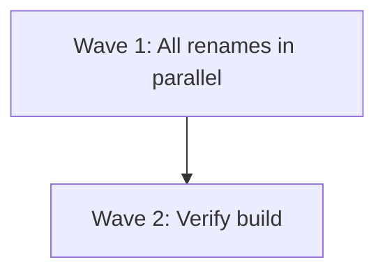

# Plan: Rename "cortex2" → "cortex" across the entire codebase

## Purpose
Replace every occurrence of the string "cortex2" (case-sensitive) with "cortex", and every occurrence of "Cortex2" (title-case) with "Cortex". This includes source code comments, string literals, doc comments, file-system path references, and the Cargo.lock package name.

## Dependency Graph

All file edits are independent (no task consumes another's output), so they can all be done in parallel. After all edits, a single verification step confirms the build succeeds.

## Progress

### Wave 1 — Rename all occurrences (all independent, can run in parallel)
- [x] 1. `src/main.rs` — 4 occurrences of `cortex2` (comments, clap name, tracing messages)
- [x] 2. `src/persistence/db.rs` — 2 occurrences of `cortex2` (doc comment path, `.join("cortex2")`)
- [x] 3. `src/config/mod.rs` — 2 occurrences of `cortex2` (doc comment path, `.join("cortex2")`)
- [x] 4. `src/tui/mod.rs` — 1 occurrence of `cortex2` (module-level doc comment)
- [x] 5. `src/config/types.rs` — 1 occurrence of `Cortex2` (module-level doc comment)
- [x] 6. `src/state/types.rs` — 1 occurrence of `Cortex2` (module-level doc comment)
- [x] 7. `Cargo.lock` — 1 occurrence of `cortex2` (package name)

### Wave 2 — Verification
- [x] 8. Run `cargo check` to verify the project compiles cleanly (depends: all Wave 1 tasks)

## Detailed Specifications

### Task 1: `src/main.rs` (4 replacements)
| Line | Current | Replacement |
|------|---------|-------------|
| 21 | `/// cortex2 — TUI Kanban board with OpenCode SDK integration` | `/// cortex — TUI Kanban board with OpenCode SDK integration` |
| 23 | `#[command(name = "cortex2", version, about = "...")]` | `#[command(name = "cortex", version, about = "...")]` |
| 89 | `tracing::info!("Starting cortex2...");` | `tracing::info!("Starting cortex...");` |
| 283 | `tracing::info!("cortex2 exited cleanly");` | `tracing::info!("cortex exited cleanly");` |

**Strategy:** Use `replaceAll` on `cortex2` → `cortex` in this file (all 4 are plain `cortex2`).

### Task 2: `src/persistence/db.rs` (2 replacements)
| Line | Current | Replacement |
|------|---------|-------------|
| 293 | `/// Returns the default database path: \`~/.local/share/cortex2/cortex.db\`.` | `...cortex/cortex.db\`...` |
| 299 | `.join("cortex2")` | `.join("cortex")` |

**Strategy:** Use `replaceAll` on `cortex2` → `cortex`.

### Task 3: `src/config/mod.rs` (2 replacements)
| Line | Current | Replacement |
|------|---------|-------------|
| 12 | `/// Returns the default config path: \`~/.config/cortex2/cortex.toml\`.` | `...cortex/cortex.toml\`...` |
| 16 | `.join("cortex2")` | `.join("cortex")` |

**Strategy:** Use `replaceAll` on `cortex2` → `cortex`.

### Task 4: `src/tui/mod.rs` (1 replacement)
| Line | Current | Replacement |
|------|---------|-------------|
| 1 | `//! TUI module — terminal user interface for cortex2.` | `//! TUI module — terminal user interface for cortex.` |

**Strategy:** Single string replacement of `cortex2.` → `cortex.` (with trailing dot to be safe).

### Task 5: `src/config/types.rs` (1 replacement)
| Line | Current | Replacement |
|------|---------|-------------|
| 1 | `//! Configuration type definitions for Cortex2.` | `//! Configuration type definitions for Cortex.` |

**Strategy:** Replace `Cortex2.` → `Cortex.`.

### Task 6: `src/state/types.rs` (1 replacement)
| Line | Current | Replacement |
|------|---------|-------------|
| 1 | `//! Core domain types for the Cortex2 application.` | `//! Core domain types for the Cortex application.` |

**Strategy:** Replace `Cortex2 application` → `Cortex application`.

### Task 7: `Cargo.lock` (1 replacement)
| Line | Current | Replacement |
|------|---------|-------------|
| 389 | `name = "cortex2"` | `name = "cortex"` |

**Strategy:** Replace `name = "cortex2"` → `name = "cortex"`. Note: `Cargo.lock` is auto-generated; this change will be overwritten on the next `cargo check`/`cargo build`. However, since `Cargo.toml` already has `name = "cortex"`, the lock file will self-correct after any cargo command. This task is therefore optional but included for completeness.

## Files NOT Changed

| File | Reason |
|------|--------|
| `.git/logs/refs/heads/main` | Git internal log — not user-editable; will update naturally with new commits |
| `.git/logs/HEAD` | Git internal log — not user-editable |
| `.git/logs/refs/stash` | Git internal log — not user-editable |
| `.opencode/plans/a7f3c-cortex2-kanban-tui.md` | Historical planning document — renaming would alter the historical record; left as-is |

## Surprises & Discoveries

- `Cargo.toml` already has `name = "cortex"` — it was likely already renamed there. The Cargo.lock still references `cortex2` because no build has been run since the Cargo.toml rename.
- The project directory itself is already named `cortex` (not `cortex2`).
- Only two case variants exist: `cortex2` (lowercase, 11 occurrences) and `Cortex2` (title-case, 2 occurrences). No `CORTEX2` (all-caps) occurrences.

## Decision Log

1. **Exclude `.git/` files** — These are git internals that cannot be meaningfully edited and would be regenerated.
2. **Exclude `.opencode/plans/` historical plan** — This is a record of past planning sessions; renaming it would misrepresent history.
3. **Include `Cargo.lock`** — Even though it's auto-generated, editing it ensures consistency immediately. It will also self-correct on next build.
4. **Replace `Cortex2` → `Cortex`** (not `cortex`) — Title-case references in doc comments should remain title-case.

## Outcomes & Retrospective

All 8 tasks completed successfully.

**Summary:** Replaced all 13 occurrences of `cortex2`/`Cortex2` across 7 files with `cortex`/`Cortex` respectively. The project compiles cleanly with `cargo check` (no new warnings or errors).

**Files modified:**
1. `src/main.rs` — 4 replacements (doc comment, clap name, 2 tracing messages)
2. `src/persistence/db.rs` — 2 replacements (doc comment path, `.join("cortex2")`)
3. `src/config/mod.rs` — 2 replacements (doc comment path, `.join("cortex2")`)
4. `src/tui/mod.rs` — 1 replacement (module doc comment)
5. `src/config/types.rs` — 1 replacement (module doc comment, `Cortex2` → `Cortex`)
6. `src/state/types.rs` — 1 replacement (module doc comment, `Cortex2` → `Cortex`)
7. `Cargo.lock` — 1 replacement (package name)

**Verification:** `cargo check` — passed with 0 errors, 13 pre-existing warnings (all unrelated to rename).
