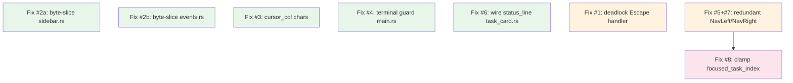

# Plan: Fix Critical & High-Priority Review Issues

## Purpose
Fix 8 issues found in ensemble code review of the task view regression work. Two critical panics/deadlocks, six high-priority bugs. Medium-priority items are deferred.

## Dependency Graph



**Wave 1** (green): 5 independent fixes across 5 different files — fully parallelizable.
**Wave 2** (orange): `app.rs` cluster — no overlap between lines 136-142, 212-234, and 415-421, so F and G are also parallel with each other.
**Wave 3** (pink): Clamping (H) depends on G being done first so we know which callers of `update_focused_task_id` remain.

## Progress

### Wave 1 — Independent single-file fixes (parallel)
- [ ] Fix #2a: byte-slice panic in `src/tui/sidebar.rs:59-60`
- [ ] Fix #2b: byte-slice panic in `src/opencode/events.rs:131`
- [ ] Fix #3: `cursor_col` byte offset in `src/state/types.rs:326`
- [ ] Fix #4: terminal state guard in `src/main.rs:114-120`
- [ ] Fix #6: wire up `status_line` in `src/tui/task_card.rs:54-87`

### Wave 2 — `src/tui/app.rs` cluster (parallel within, separate hunks)
- [ ] Fix #1: deadlock in Escape handler `src/tui/app.rs:136-142`
- [ ] Fix #5+#7: remove redundant lines in NavLeft/NavRight `src/tui/app.rs:212-234`

### Wave 3 — Clamping (depends on Wave 2)
- [ ] Fix #8: clamp `focused_task_index` in `update_focused_task_id` + after `move_task`

## Detailed Specifications

---

### Fix #2a: byte-slice panic — `src/tui/sidebar.rs:59-60`

**Current (panics on multi-byte UTF-8):**
```rust
let display_name = if project.name.len() > max_name_len {
    format!("{}...", &project.name[..max_name_len.saturating_sub(3)])
} else {
    project.name.clone()
};
```

**Fix:** Use `chars()`-based truncation (same pattern as `task_card.rs:33-41`):
```rust
let display_name = if project.name.chars().count() > max_name_len {
    let truncated: String = project.name.chars().take(max_name_len.saturating_sub(3)).collect();
    format!("{}...", truncated)
} else {
    project.name.clone()
};
```

**Note:** `max_name_len` comes from `inner.width as usize` which is a display-width concept. This fix uses char count as a safe approximation. A proper unicode-width fix is deferred to medium priority (#11).

---

### Fix #2b: byte-slice panic — `src/opencode/events.rs:131`

**Current:**
```rust
format!("Question pending: {}", &question[..question.len().min(50)])
```

`question.len().min(50)` is a byte count, not char count. If `question` has multi-byte chars, slicing at a byte boundary panics.

**Fix:**
```rust
let preview: String = question.chars().take(50).collect();
format!("Question pending: {}", preview)
```

---

### Fix #3: `cursor_col` byte offset — `src/state/types.rs:326`

**Current:**
```rust
cursor_col: task.title.len(),
```

`cursor_col` is later used as a char index for `String::insert()`. `task.title.len()` returns byte count.

**Fix:**
```rust
cursor_col: task.title.chars().count(),
```

---

### Fix #4: terminal state not recovered — `src/main.rs:114-120`

**Current:**
```rust
App::setup_terminal()?;             // line 114

let runtime = tokio::runtime::Builder  // line 117
    .new_multi_thread()
    .enable_all()
    .build()
    .context("Failed to create Tokio runtime")?;  // line 120
```

If runtime creation fails (line 120), `setup_terminal()` has already put the terminal in raw mode, but `app.teardown()` is never reached (it's inside `runtime.block_on`). The user's terminal is left broken.

**Fix:** Add a `scopeguard`-style defer that restores the terminal if the runtime creation fails. No external crate needed — use a closure + `defer` pattern, or a simple guard struct:

```rust
App::setup_terminal()?;

// Guard: if anything below fails, restore terminal
let _terminal_guard = scopeguard::guard((), | _| {
    let _ = crossterm::terminal::disable_raw_mode();
    let _ = crossterm::execute!(
        std::io::stdout(),
        crossterm::terminal::LeaveAlternateScreen
    );
});

let runtime = tokio::runtime::Builder::new_multi_thread()
    .enable_all()
    .build()
    .context("Failed to create Tokio runtime")?;
```

**Dependency:** Add `scopeguard` to `Cargo.toml` dev+main dependencies. Alternatively, write a local `Drop` guard struct inline to avoid the new dependency.

**Decision:** Use a local `Drop` guard struct (defined in `main.rs` or `tui/app.rs`) to avoid adding a crate dependency for a single use.

```rust
struct TerminalGuard;
impl Drop for TerminalGuard {
    fn drop(&mut self) {
        let _ = crossterm::terminal::disable_raw_mode();
        let _ = crossterm::execute!(
            std::io::stdout(),
            crossterm::terminal::LeaveAlternateScreen
        );
    }
}
```

Then:
```rust
App::setup_terminal()?;
let _terminal_guard = TerminalGuard;
```

The guard is intentionally not dropped on the happy path because `app.teardown()` handles it. But if we return early (error), the guard restores the terminal. On the happy path, `app.teardown()` runs first, then the guard's `Drop` fires harmlessly (double disable is fine — both operations are idempotent).

Actually — a cleaner approach: the guard should only fire if teardown hasn't run. We can use a flag. But given that `disable_raw_mode` and `LeaveAlternateScreen` are idempotent, the double-call on happy path is acceptable.

---

### Fix #6: unused `status_line` variable — `src/tui/task_card.rs:54-61, 80-96`

**Current code builds `status_line` (lines 54-61) with permission/question indicators but never uses it.** Lines 80-96 render `status_icon` and `status_text` separately without the indicators.

**Fix:** Replace the manual rendering at lines 81-86 with the already-built `status_line`:

```rust
if inner.height >= 2 {
    let status_para = Paragraph::new(Line::from(vec![
        Span::styled(
            format!("{} ", status_icon),
            Style::default().fg(status_color),
        ),
        Span::styled(status_line, Style::default().fg(status_color)),
    ]));
    // ... render unchanged ...
}
```

Change `status_text` reference on line 86 to `status_line`. This wires up the permission (`!N`) and question (`?N`) indicators that were being computed but discarded.

---

### Fix #1: deadlock in Escape handler — `src/tui/app.rs:136-142`

**Current (deadlock):**
```rust
{
    let state = self.state.lock().unwrap();       // guard A acquired
    if state.ui.focused_panel == FocusedPanel::TaskDetail {
        if key.code == KeyCode::Esc {
            let mut state = self.state.lock().unwrap();  // guard B: DEADLOCK!
            state.close_task_detail();
            return;
        }
    }
}
```

The second `self.state.lock().unwrap()` tries to acquire the same `Mutex` while the first guard is still held (shadowing doesn't drop).

**Fix:** Read panel state in a short-lived scope, drop the lock, then re-acquire mutably:

```rust
{
    let is_detail_escape = {
        let state = self.state.lock().unwrap();
        state.ui.focused_panel == FocusedPanel::TaskDetail && key.code == KeyCode::Esc
    };
    // First lock dropped here
    if is_detail_escape {
        let mut state = self.state.lock().unwrap();
        state.close_task_detail();
        return;
    }
}
```

Also clean up: remove the `// TODO: handle y/n for permission approval here` if it's orphaned outside the detail check, or keep it if it's still relevant. Based on current code, the TODO is inside the `focused_panel == TaskDetail` check, so it should stay.

---

### Fix #5+#7: redundant code in NavLeft/NavRight — `src/tui/app.rs:212-234`

**Current NavLeft (lines 212-222):**
```rust
Some(Action::NavLeft) => {
    let visible = self.config.columns.visible_column_ids();
    let mut state = self.state.lock().unwrap();
    if state.kanban.focused_column_index > 0 {
        state.kanban.focused_column_index -= 1;
        if let Some(col_id) = visible.get(state.kanban.focused_column_index) {
            state.set_focused_column(col_id);        // sets ui.focused_column + syncs focused_task_id
            state.ui.focused_column = col_id.to_string();  // REDUNDANT (#5)
            update_focused_task_id(&mut state, col_id);      // REDUNDANT (#7)
        }
    }
}
```

`set_focused_column(col_id)` already:
1. Sets `self.ui.focused_column = column.to_string()` (line 162)
2. Syncs `self.ui.focused_task_id` from the column's focused index (lines 170-172)

So the next two lines are redundant.

**Fix for both NavLeft and NavRight:** Remove the redundant lines:

```rust
Some(Action::NavLeft) => {
    let visible = self.config.columns.visible_column_ids();
    let mut state = self.state.lock().unwrap();
    if state.kanban.focused_column_index > 0 {
        state.kanban.focused_column_index -= 1;
        if let Some(col_id) = visible.get(state.kanban.focused_column_index) {
            state.set_focused_column(col_id);
        }
    }
}
Some(Action::NavRight) => {
    let visible = self.config.columns.visible_column_ids();
    let mut state = self.state.lock().unwrap();
    if state.kanban.focused_column_index + 1 < visible.len() {
        state.kanban.focused_column_index += 1;
        if let Some(col_id) = visible.get(state.kanban.focused_column_index) {
            state.set_focused_column(col_id);
        }
    }
}
```

Note: `update_focused_task_id` function still remains for NavUp/NavDown callers (lines 242, 257). Do NOT remove the function yet.

---

### Fix #8: clamp `focused_task_index` — `src/tui/app.rs:415-421`

**Problem:** `update_focused_task_id` reads `focused_task_index[col_id]` and uses it to index into `columns[col_id]` without bounds checking. If tasks are moved/deleted, the index can be stale and out of bounds.

**Current:**
```rust
fn update_focused_task_id(state: &mut AppState, col_id: &str) {
    let idx = state.kanban.focused_task_index.get(col_id).copied().unwrap_or(0);
    if let Some(task_ids) = state.kanban.columns.get(col_id) {
        let task_id = task_ids.get(idx).cloned();
        state.ui.focused_task_id = task_id;
    }
}
```

**Fix:** Clamp `idx` to valid range:

```rust
fn update_focused_task_id(state: &mut AppState, col_id: &str) {
    let idx = state.kanban.focused_task_index.get(col_id).copied().unwrap_or(0);
    if let Some(task_ids) = state.kanban.columns.get(col_id) {
        let clamped = idx.min(task_ids.len().saturating_sub(1));
        state.ui.focused_task_id = task_ids.get(clamped).cloned();
    }
}
```

**Also fix in `set_focused_column`** (`src/state/store.rs:161-173`) — same clamping issue:

```rust
pub fn set_focused_column(&mut self, column: &str) {
    self.ui.focused_column = column.to_string();
    let idx = self
        .kanban
        .focused_task_index
        .entry(column.to_string())
        .or_insert(0);
    if let Some(task_ids) = self.kanban.columns.get(column) {
        let clamped = (*idx).min(task_ids.len().saturating_sub(1));
        self.ui.focused_task_id = task_ids.get(clamped).cloned();
    }
}
```

**Also add clamping after `move_task`** — after a task is moved from a column, the remaining column's `focused_task_index` may be out of bounds. Add a sync call or inline clamp in `store.rs:move_task()` (lines 78-103). After removing the task from the source column (line 91), clamp the source column's index:

```rust
// In move_task, after line 91 (tasks.retain):
if let Some(tasks) = self.kanban.columns.get_mut(&from_column.0) {
    tasks.retain(|id| id != task_id);
}
// Clamp focused_task_index for source column
if let Some(idx) = self.kanban.focused_task_index.get_mut(&from_column.0) {
    if !tasks_after_removal.is_empty() {
        *idx = (*idx).min(tasks_after_removal.len() - 1);
    }
    // If empty, leave index as-is; sync_focused_task_id will set focused_task_id = None
}
```

Wait — `tasks` is borrowed mutably. We need to restructure slightly:

```rust
// Remove from old column in kanban
if let Some(tasks) = self.kanban.columns.get_mut(&from_column.0) {
    tasks.retain(|id| id != task_id);
    // Clamp index
    if let Some(idx) = self.kanban.focused_task_index.get_mut(&from_column.0) {
        if tasks.is_empty() {
            // leave as-is; focused_task_id will be None
        } else {
            *idx = (*idx).min(tasks.len() - 1);
        }
    }
}
```

Actually there's a borrow conflict — `kanban.columns` and `kanban.focused_task_index` are both under `self.kanban`. But since they're different fields, we can borrow both mutably if we destructure or use separate borrows. Easiest approach: do it in two steps.

```rust
// Remove from old column
let from_col = &from_column.0;
if let Some(tasks) = self.kanban.columns.get_mut(from_col) {
    tasks.retain(|id| id != task_id);
}

// Clamp index for source column
if let Some(tasks) = self.kanban.columns.get(from_col) {
    if let Some(idx) = self.kanban.focused_task_index.get_mut(from_col) {
        if !tasks.is_empty() {
            *idx = (*idx).min(tasks.len() - 1);
        }
    }
    // Sync focused_task_id if we're still viewing the source column
    if self.ui.focused_column == *from_col {
        self.ui.focused_task_id = tasks.get(*self.kanban.focused_task_index.get(from_col).unwrap_or(&0)).cloned();
    }
}
```

This is getting complex. A simpler approach: after `move_task`, call `set_focused_column` for both the source and destination columns (or just the source, since destination was just written to). But that changes column focus. 

Simplest correct approach: add a `clamp_focused_task_index` method to `AppState`:

```rust
pub fn clamp_focused_task_index(&mut self, col_id: &str) {
    let idx = self.kanban.focused_task_index.get(col_id).copied().unwrap_or(0);
    if let Some(tasks) = self.kanban.columns.get(col_id) {
        let clamped = if tasks.is_empty() { 0 } else { idx.min(tasks.len() - 1) };
        self.kanban.focused_task_index.insert(col_id.to_string(), clamped);
        self.ui.focused_task_id = tasks.get(clamped).cloned();
    } else {
        self.ui.focused_task_id = None;
    }
}
```

Then call `self.clamp_focused_task_index(&from_column.0)` at the end of `move_task`. This is clean and reusable.

---

## Surprises & Discoveries

1. **`set_focused_column` already syncs `focused_task_id`** — This means NavLeft/NavRight were doing triple work (set_focused_column + manual focused_column + update_focused_task_id). Only `set_focused_column` was needed.
2. **`update_focused_task_id` is still needed for NavUp/NavDown** — These change the index within the same column and then need to sync the task ID. We can't remove the function entirely, only the calls from NavLeft/NavRight.
3. **Terminal guard double-cleanup is harmless** — Both `disable_raw_mode` and `LeaveAlternateScreen` are idempotent, so the `Drop` guard firing after `teardown()` is fine.

## Decision Log

| Decision | Rationale |
|----------|-----------|
| Use local `Drop` guard instead of `scopeguard` crate | Avoid adding a dependency for a single use. 5-line struct is sufficient. |
| Use `chars()`-based truncation instead of unicode-width | Matches existing pattern in `task_card.rs`. Unicode-width is deferred (#11, medium). |
| Keep `update_focused_task_id` as free function for now | Still called by NavUp/NavDown. Moving to `AppState` method is a refactor, not a bug fix. |
| Add `clamp_focused_task_index` as store method | Clean, reusable, avoids borrow-checker complexity in `move_task`. |
| Wire up `status_line` rather than remove dead code | The indicators were intentionally built; they just weren't connected to rendering. |

## Outcomes & Retrospective

*(To be completed during execution)*
