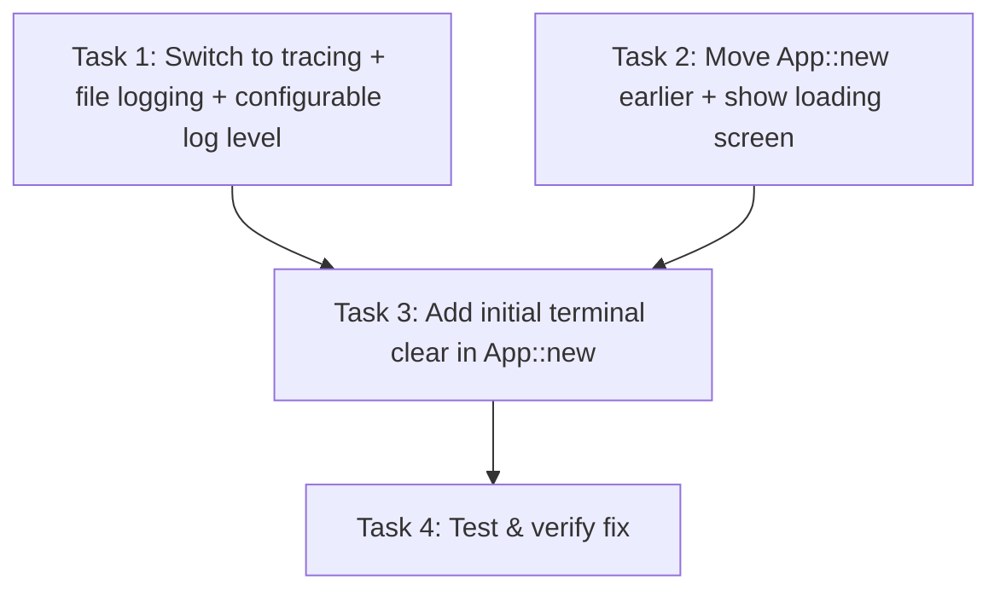

# Plan: Fix Startup Log Lines Visible Behind TUI

## Purpose

On application startup, raw log lines like `INFO cortex] Starting SSE event loop for project 469853da-...` are rendered visibly on screen before the TUI takes over. The root cause is that `env_logger` writes to stderr throughout the entire startup sequence (server boot, SSE loop spawn, etc.) **before** the alternate screen buffer is entered, and background tokio tasks continue logging to stderr **after** the TUI is active, corrupting the rendered frames.

Additionally, the log level should be configurable via the app's TOML config file (not only via `RUST_LOG` env var), and the logging framework should be switched from `env_logger` to `tracing` for better async integration and non-blocking file writes.

## Root Cause Analysis

The startup sequence in `src/main.rs` is:

| Step | Line | Action | Screen State |
|------|------|--------|-------------|
| 1 | 43 | `env_logger::init()` — logs to **stderr** | Normal terminal |
| 2 | 47 | `log::info!("Starting cortex...")` | Written to stderr |
| 3 | 117–138 | Server startup (up to 25s): `info!`/`warn!` calls | Written to stderr |
| 4 | 147 | `log::info!("Starting SSE event loop for project {}")` | Written to stderr |
| 5 | 193 | `App::new()` → `EnterAlternateScreen` | Switches to alt buffer |
| 6 | 194 | `app.run()` → first `terminal.draw()` | TUI renders |

**Two problems:**

1. **Pre-TUI logging (steps 2–4):** Log messages are written to the primary terminal buffer. When `EnterAlternateScreen` is called, the alternate buffer is clean — but the user already saw the log output on the primary screen. If the app crashes or exits, `LeaveAlternateScreen` reveals those log lines again.

2. **Post-TUI logging from background tasks:** SSE event loops (`events.rs:68,151`) and persistence tasks (`main.rs:175`) run in spawned tokio tasks that call `warn!()`/`error!()` at any time. These write to stderr, which appears on the **alternate screen buffer itself**, corrupting the TUI rendering. `terminal.draw()` on the next tick overwrites the corruption, but it's visible as a flicker.

## Dependency Graph



## Progress

### Wave 1 — Core logging fix
- [ ] Task 1: Switch from `env_logger` to `tracing` ecosystem with file-based logging and configurable log level
- [ ] Task 2: Move alternate screen setup earlier in `main()` to hide any residual startup output

### Wave 2 — Polish and safety
- [ ] Task 3: Add an explicit terminal clear after entering alternate screen buffer (depends: Task 2)
- [ ] Task 4: Verify no remaining log paths write to stderr/stdout during TUI operation (depends: Task 1, Task 3)

## Detailed Specifications

### Task 1: Switch from `env_logger` to `tracing` with file-based logging and configurable log level

**Files:** `Cargo.toml`, `src/main.rs`, `src/config/types.rs`, `src/config/defaults.rs`, and all `.rs` files using `log::*!` macros (7 files, ~30 call sites)

This task replaces `env_logger` with the `tracing` ecosystem (`tracing`, `tracing-subscriber`, `tracing-appender`, `tracing-log`) and adds a `[log]` section to the config file for configurable log levels.

#### 1A. Add dependencies to `Cargo.toml`

Replace:
```toml
log = "0.4"
env_logger = "0.11"
```

With:
```toml
tracing = "0.1"
tracing-subscriber = { version = "0.3", features = ["env-filter"] }
tracing-appender = "0.2"
tracing-log = "0.2"
log = "0.4"  # keep for crate compatibility (tracing-log bridges log records)
```

> **Note:** Keep the `log` crate as a dependency because some downstream crates (e.g., `reqwest`, `rusqlite`) emit `log` records. `tracing-log` installs a `log` -> `tracing` bridge so these records are captured by the `tracing` subscriber and written to the log file.

#### 1B. Add `[log]` config section

In `src/config/types.rs`, add a `LogConfig` struct and wire it into `CortexConfig`:

```rust
// ─── Log Configuration ───

/// Logging configuration.
#[derive(Debug, Clone, Serialize, Deserialize)]
pub struct LogConfig {
    /// Log level: "trace", "debug", "info", "warn", "error".
    /// Overridden by the `RUST_LOG` environment variable if set.
    #[serde(default = "default_log_level")]
    pub level: String,
}

fn default_log_level() -> String {
    "info".to_string()
}

impl Default for LogConfig {
    fn default() -> Self {
        Self {
            level: default_log_level(),
        }
    }
}
```

Add to `CortexConfig`:
```rust
pub struct CortexConfig {
    // ... existing fields ...
    #[serde(default)]
    pub log: LogConfig,
}
```

In `src/config/defaults.rs`, add to `DEFAULT_CONFIG_TOML`:
```toml
[log]
level = "info"
```

And add `log: LogConfig::default()` to the `default_config()` function.

#### 1C. Initialize tracing subscriber in `main.rs`

Replace the existing `env_logger::Builder` call (line 43–45) with:

```rust
use tracing_subscriber::EnvFilter;
use tracing_subscriber::prelude::*;

// Initialize tracing with file appender
let log_dir = crate::config::dirs_or_home()
    .join(".local")
    .join("share")
    .join("cortex")
    .join("logs");
std::fs::create_dir_all(&log_dir).ok();

let file_appender = tracing_appender::rolling::never(&log_dir, "cortex.log");
let (non_blocking, _guard) = tracing_appender::non_blocking(file_appender);

// Build filter: config sets default, RUST_LOG env var overrides
let filter = EnvFilter::try_from_default_env()
    .unwrap_or_else(|_| EnvFilter::new(&config.log.level));

tracing_subscriber::registry()
    .with(filter)
    .with(
        tracing_subscriber::fmt::layer()
            .with_writer(non_blocking)
            .with_ansi(false)
            .with_target(false)
    )
    .init();

// Bridge log records from crates using the `log` facade
tracing_log::LogTracer::init().ok();

tracing::debug!("Logging to {}/cortex.log", log_dir.display());
```

> **Important:** The `_guard` must remain alive for the entire duration of the program. Store it in a variable in `main()` — do not drop it early, or log output will be lost.

> **Note on ordering:** Config must be loaded **before** logger init now (so we can read `config.log.level`). Currently config is loaded at line 56, after logger init at line 43. Swap the order: load config first, then init the logger with the config value.

#### 1D. Replace `log::*!` macros with `tracing::*!` across all source files

Simple find-and-replace in all 7 files (~30 call sites). The macro signatures are identical:

| Before | After |
|--------|-------|
| `log::info!(...)` | `tracing::info!(...)` |
| `log::warn!(...)` | `tracing::warn!(...)` |
| `log::error!(...)` | `tracing::error!(...)` |
| `log::debug!(...)` | `tracing::debug!(...)` |

Files to update:
- `src/main.rs` — 14 call sites
- `src/config/mod.rs` — 3 call sites
- `src/opencode/events.rs` — 1 call site
- `src/orchestration/engine.rs` — 4 call sites
- `src/persistence/db.rs` — 1 call site
- `src/persistence/mod.rs` — 1 call site
- `src/tui/app.rs` — 3 call sites

#### 1E. Make `dirs_or_home()` public

In `src/config/mod.rs`, change `fn dirs_or_home()` to `pub fn dirs_or_home()` so it can be called from `main.rs`.

#### 1F. Remove `env_logger` dependency

Remove `env_logger = "0.11"` from `Cargo.toml` (replaced by tracing deps).

#### Summary of all changes in this task:
1. `Cargo.toml` — add `tracing`, `tracing-subscriber`, `tracing-appender`, `tracing-log`; remove `env_logger`
2. `src/config/types.rs` — add `LogConfig` struct, add `log` field to `CortexConfig`
3. `src/config/defaults.rs` — add `[log]` section to default TOML, add `LogConfig::default()` to `default_config()`
4. `src/config/mod.rs` — make `dirs_or_home()` public
5. `src/main.rs` — swap config load before logger init, replace `env_logger` init with tracing subscriber setup, replace all `log::*!` with `tracing::*!`
6. All other `.rs` files — replace `log::*!` with `tracing::*!`

### Task 2: Move alternate screen setup earlier in `main()`

**Files:** `src/main.rs`, `src/tui/app.rs`

Move the terminal setup (`enable_raw_mode` + `EnterAlternateScreen`) to happen **before** server startup and SSE loop spawning. This ensures any residual stdout/stderr output is hidden behind the alternate screen as early as possible.

**Approach:** Split `App::new()` into two phases:
1. `App::init_terminal()` — enters raw mode + alternate screen (called early in `main()`)
2. `App::new()` — creates the Terminal backend, key matcher, etc. (called where it currently is)

Or simpler: call `enable_raw_mode()` and `EnterAlternateScreen` directly in `main()` before the server startup loop, then pass the already-configured terminal into `App::new()`.

Changes:
1. In `src/tui/app.rs`, extract terminal setup into a standalone function:
   ```rust
   pub fn setup_terminal() -> anyhow::Result<()> {
       crossterm::terminal::enable_raw_mode()?;
       crossterm::execute!(std::io::stdout(), crossterm::terminal::EnterAlternateScreen)?;
       Ok(())
   }
   ```
2. In `src/main.rs`, call `App::setup_terminal()` right after logger init, before any server/SSE work.
3. Keep `App::new()` doing the rest (backend creation, key matcher).

### Task 3: Add explicit terminal clear after alternate screen entry

**Files:** `src/tui/app.rs`

After entering the alternate screen buffer, explicitly clear it to ensure no residual content from the primary screen bleeds through. This is a safety measure.

In `App::setup_terminal()` (from Task 2) or `App::new()`, add:
```rust
crossterm::execute!(
    std::io::stdout(),
    crossterm::terminal::Clear(crossterm::terminal::ClearType::All)
)?;
```

Also add `std::io::stdout().flush()?` to ensure the clear takes effect immediately.

### Task 4: Verify no remaining log paths write to terminal

**Files:** All files using `tracing::info!`, `tracing::warn!`, `tracing::error!`, `tracing::debug!`

Search the entire codebase for any remaining paths that could write to stdout/stderr during TUI operation:
1. Verify the tracing subscriber writes only to the file appender, never to stderr/stdout.
2. Check that no `println!` or `eprintln!` calls exist in non-test code.
3. Verify `reqwest` / other dependencies don't write to stderr during errors (they use `log`, which is bridged via `tracing-log`).
4. Check `tokio::process::Command` output handling in `server.rs` — ensure child process stdout/stderr are captured, not inherited.

## Surprises & Discoveries

1. **Server startup is slow (up to 25s):** `INITIAL_WAIT` (2s) + `HEALTH_TIMEOUT` (20s) + retries. During this entire window, log output goes to the terminal. This amplifies the visual impact of the bug.
2. **Background tasks log at `warn!` level** — SSE reconnection messages (`events.rs:151`) and DB save errors (`main.rs:175`) will periodically corrupt the TUI if not redirected.
3. **Config must load before logger init** — Previously the order was `env_logger::init()` → `load_config()`. With configurable log levels, this must be reversed: `load_config()` → `tracing::init(config.log.level)`.
4. **`tracing-appender::non_blocking` returns a guard** — The `_guard` from `tracing_appender::non_blocking()` must live for the entire program duration. Dropping it flushes and disables the writer.

## Decision Log

- **Decision: Switch to `tracing` ecosystem instead of `env_logger::Target::Pipe`.** Rationale:
  - **Async-native:** The codebase has 10+ `tokio::spawn` calls across 4 files. `tracing` integrates with async contexts via spans, making it far easier to trace which spawned task produced a log line.
  - **Non-blocking file writes:** `tracing-appender::non_blocking()` wraps the file writer in a dedicated background thread, so log I/O never blocks the calling task. `env_logger::Target::Pipe` is synchronous — every `log::info!` in a tokio task blocks that task on disk I/O.
  - **Log rotation built-in:** `tracing-appender::rolling::` provides daily/hourly/never rotation out of the box. `env_logger` has no rotation support.
  - **Small migration cost:** Only ~30 `log::*!` call sites across 7 files — a straightforward find-and-replace. The macro signatures are identical.
  - **`tracing-log` bridge:** Downstream crates (`reqwest`, `rusqlite`, etc.) use the `log` facade. `tracing-log::LogTracer` captures those records into the `tracing` subscriber, so nothing is lost.
  - **Future-proofing:** `#[instrument]` for async functions, structured fields, and span propagation become available as the codebase grows.
  - **`tracing-subscriber::EnvFilter`** naturally supports the config-file-default + `RUST_LOG`-override pattern: `EnvFilter::try_from_default_env().unwrap_or_else(|_| EnvFilter::new(config_level))`.

- **Decision: Config uses simple `level = "info"` field** (not full `RUST_LOG` directive syntax). Rationale:
  - The config file targets end users who expect a simple setting like `level = "debug"`.
  - Power users who need module-level filtering (`cortex=debug,reqwest=warn`) can still use `RUST_LOG` env var, which overrides the config value.
  - The valid values are: `"trace"`, `"debug"`, `"info"`, `"warn"`, `"error"`.

- **Decision: Store log files at `~/.local/share/cortex/logs/cortex.log`** using the existing `dirs_or_home()` helper from `src/config/mod.rs`. This follows the same XDG data directory pattern already used by `default_db_path()` (`~/.local/share/cortex/cortex.db`) and keeps all cortex artifacts under one base path. The `logs/` subdirectory is created with `fs::create_dir_all()` on startup.

- **Decision: Split terminal setup from `App::new()`** to call it earlier in `main()`, rather than restructuring the entire startup flow. This is the least invasive approach.

- **Decision: Keep `log` crate as a dependency** (alongside `tracing`) so that `tracing-log` can bridge log records from downstream crates. This is standard practice when migrating to tracing.

## Outcomes & Retrospective

_To be completed during execution._
